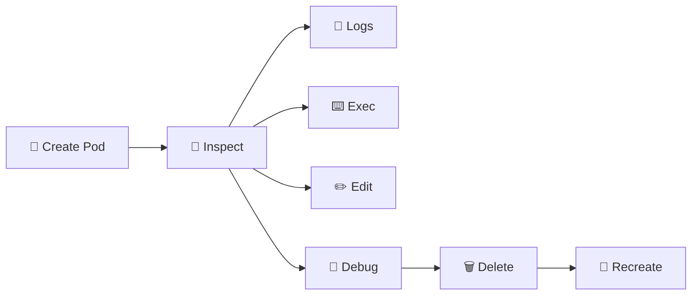

# Pod Management 🛠️

## 1. Overview

Pod management covers the day-to-day commands used to create, inspect, modify, troubleshoot, and delete Pods.

Although production Pods are usually managed by higher-level controllers such as Deployments or StatefulSets, direct Pod commands remain essential for testing, debugging, and administration.

The most useful tools are `kubectl get`, `describe`, `logs`, `exec`, `edit`, `delete`, and `port-forward`.

---

## 2. Management Workflow



---

## 3. Cheat Sheet

List Pods:

```bash id="fu3rqp"
kubectl get pods
kubectl get pods -A
kubectl get pods -o wide
```

Inspect a Pod:

```bash id="fql09n"
kubectl describe pod <pod-name>
kubectl get pod <pod-name> -o yaml
```

View logs:

```bash id="74d2rs"
kubectl logs <pod-name>
kubectl logs -f <pod-name>
kubectl logs <pod-name> -c <container-name>
kubectl logs <pod-name> --previous
```

Execute commands:

```bash id="i76f8h"
kubectl exec <pod-name> -- env
kubectl exec -it <pod-name> -- /bin/sh
```

Edit or delete:

```bash id="xozjja"
kubectl edit pod <pod-name>
kubectl delete pod <pod-name>
```

Copy files:

```bash id="fr0drj"
kubectl cp ./file.txt <pod-name>:/tmp/file.txt
```

Forward a local port:

```bash id="e7f4ck"
kubectl port-forward pod/<pod-name> 8080:80
```

---

## 4. Practical Example

Suppose an NGINX Pod is running, but the application is not responding.

A quick investigation might be:

```bash id="b22a8z"
kubectl get pods -o wide
kubectl describe pod nginx
kubectl logs nginx
kubectl exec -it nginx -- /bin/sh
```

You can then test the application from inside the container:

```bash id="5ovsw4"
curl localhost:80
```

If required, temporarily expose it locally:

```bash id="m4ehyl"
kubectl port-forward pod/nginx 8080:80
```

Then access:

```text id="j70rhn"
http://localhost:8080
```

---

## 5. YAML Example

```yaml id="x4guxa"
apiVersion: v1
kind: Pod
metadata:
  name: nginx
  labels:
    app: nginx
spec:
  containers:
    - name: nginx
      image: nginx:1.27
      ports:
        - containerPort: 80
```

Create or update it:

```bash id="u4t9kp"
kubectl apply -f pod.yaml
```

---

## 6. Common Problems 🚨

* Wrong namespace selected
* Wrong container selected in a multi-container Pod
* `exec` fails because no shell exists
* Logs are missing after a restart
* Pod deletion is followed by immediate recreation
* Direct Pod edits are overwritten by a controller
* Port forwarding fails because the container is not listening

---

## 7. Interview Questions 🎯

1. How do you inspect a Pod?
2. How do you view previous container logs?
3. How do you execute a shell inside a Pod?
4. How do you copy files into a Pod?
5. What does `kubectl port-forward` do?
6. Why might a deleted Pod immediately reappear?
7. Why should production Pods usually be managed by controllers?

---

## 8. Related Topics 🔗

* Pods
* kubectl
* Pod Lifecycle
* Logs
* Deployments
* Ephemeral Containers
* Troubleshooting
