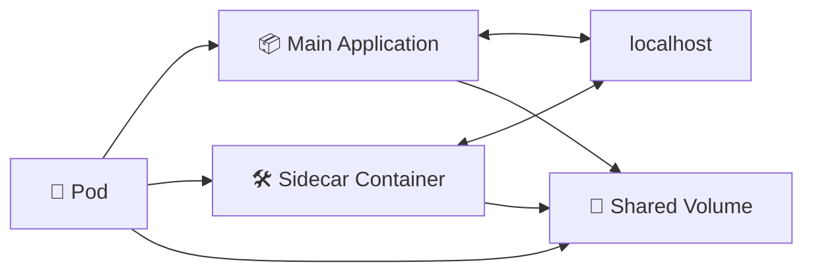

# Sidecar Containers 🛠️

## 1. Overview

A **sidecar container** is a supporting container that runs alongside the main application container inside the same Pod.

The sidecar extends or assists the primary application without becoming part of the application itself.

Common sidecar use cases include:

* 📜 Log collection
* 🌐 Proxying network traffic
* 🔄 Configuration synchronization
* 🔐 Certificate renewal
* 📦 File processing
* 📊 Metrics collection

Because both containers run in the same Pod, they can share the same network namespace and volumes.

---

## 2. Sidecar Pattern



The main application focuses on business logic, while the sidecar handles a supporting responsibility.

---

## 3. Cheat Sheet

List containers inside a Pod:

```bash
kubectl get pod <pod-name> \
  -o jsonpath='{.spec.containers[*].name}'
```

View sidecar logs:

```bash
kubectl logs <pod-name> -c <sidecar-name>
```

Open a shell inside the sidecar:

```bash
kubectl exec -it <pod-name> \
  -c <sidecar-name> -- /bin/sh
```

Describe the Pod:

```bash
kubectl describe pod <pod-name>
```

---

## 4. Practical Example

Suppose a web application writes logs to a shared directory.

Instead of modifying the application to send logs elsewhere, a sidecar container can continuously read the log files and forward them to a logging system.

The application handles web requests, while the sidecar handles log forwarding.

This keeps responsibilities separate while allowing both processes to remain closely connected.

---

## 5. YAML Example

```yaml
apiVersion: v1
kind: Pod
metadata:
  name: web-with-sidecar
spec:
  volumes:
    - name: shared-logs
      emptyDir: {}

  containers:
    - name: web
      image: nginx:1.27
      volumeMounts:
        - name: shared-logs
          mountPath: /var/log/nginx

    - name: log-sidecar
      image: busybox
      command:
        - sh
        - -c
        - tail -F /logs/access.log
      volumeMounts:
        - name: shared-logs
          mountPath: /logs
```

The sidecar continuously reads the log file written by NGINX.

---

## 6. Common Problems 🚨

* Sidecar crashes while the main application is healthy
* Shared volume path is incorrect
* Sidecar consumes excessive CPU or memory
* Containers compete for the same port
* Sidecar startup or shutdown order causes issues
* Logging or proxy sidecar becomes a bottleneck

---

## 7. Interview Questions 🎯

1. What is a sidecar container?
2. How is a sidecar different from an init container?
3. Why would an application use a sidecar?
4. Can sidecars communicate with the main container through `localhost`?
5. Can sidecars share volumes with the application?
6. What are common sidecar use cases?
7. What are the disadvantages of using too many sidecars?

---

## 8. Related Topics 🔗

* Pods
* Multi-Container Pods
* Init Containers
* Shared Volumes
* Logging
* Service Mesh
* Proxies
