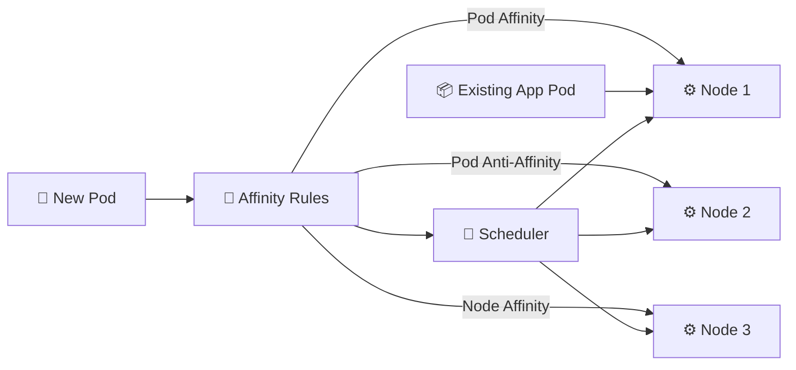

# Affinity and Anti-Affinity 🧲

## 1. Overview

**Affinity** and **anti-affinity** influence where Pods are scheduled.

* **Affinity** attracts a Pod toward certain nodes or other Pods.
* **Anti-affinity** keeps a Pod away from certain Pods or topology domains.

These rules help control placement for performance, availability, and fault tolerance.

Common uses include:

* Keeping related workloads close together
* Spreading replicas across different nodes
* Avoiding single points of failure
* Placing workloads near required hardware or services

---

## 2. Scheduling Logic



---

## 3. Main Types

| Type              | Purpose                           |
| ----------------- | --------------------------------- |
| Node Affinity     | Selects nodes based on labels     |
| Pod Affinity      | Places Pods near matching Pods    |
| Pod Anti-Affinity | Separates Pods from matching Pods |
| Required rule     | Must be satisfied                 |
| Preferred rule    | Scheduler tries to satisfy it     |

Affinity rules commonly use topology keys such as:

```text
kubernetes.io/hostname
topology.kubernetes.io/zone
```

---

## 4. Cheat Sheet

View node labels:

```bash
kubectl get nodes --show-labels
```

Add a node label:

```bash
kubectl label node <node-name> disk=ssd
```

View Pod placement:

```bash
kubectl get pods -o wide
```

Inspect scheduling problems:

```bash
kubectl describe pod <pod-name>
```

---

## 5. Practical Example

Suppose an application has three replicas.

If all three Pods run on the same worker node, one node failure could make the entire application unavailable.

Pod anti-affinity can instruct the scheduler to place replicas on different nodes whenever possible.

Node affinity can also ensure that a database workload runs only on nodes labeled with SSD storage.

---

## 6. YAML Example

```yaml
apiVersion: v1
kind: Pod
metadata:
  name: web
  labels:
    app: web
spec:
  affinity:
    podAntiAffinity:
      requiredDuringSchedulingIgnoredDuringExecution:
        - labelSelector:
            matchLabels:
              app: web
          topologyKey: kubernetes.io/hostname

  containers:
    - name: nginx
      image: nginx:1.27
```

This rule prevents the Pod from being scheduled on a node that already contains another Pod labeled `app=web`.

---

## 7. Common Problems 🚨

* Affinity rules are too restrictive
* Pod remains in `Pending`
* Node labels do not match
* Incorrect topology key
* Required rules cannot be satisfied
* Anti-affinity reduces scheduling flexibility

---

## 8. Interview Questions 🎯

1. What is affinity in Kubernetes?
2. What is the difference between node affinity and pod affinity?
3. What does pod anti-affinity do?
4. What is the difference between `required` and `preferred` rules?
5. Why is anti-affinity useful for high availability?
6. What is a topology key?
7. Why might affinity cause a Pod to remain `Pending`?

---

## 9. Related Topics 🔗

* Scheduler
* Node Labels
* Taints and Tolerations
* Topology Spread Constraints
* High Availability
* Pods
