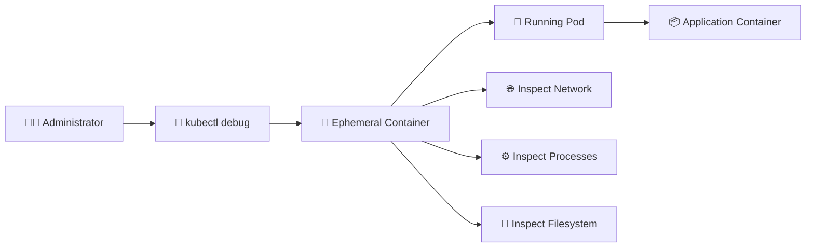

# Ephemeral Containers 🧪

## 1. Overview

**Ephemeral containers** are temporary containers added to an already running Pod for troubleshooting and debugging.

They are especially useful when the original application container is minimal, distroless, or lacks tools such as:

* `sh`
* `curl`
* `ping`
* `ps`
* `tcpdump`

Unlike normal containers, ephemeral containers are **not intended to run application workloads**. They are primarily a debugging tool.

---

## 2. Debugging Flow



The ephemeral container joins the existing Pod and can be used to inspect its environment.

---

## 3. Key Characteristics

| Feature                   | Ephemeral Container |
| ------------------------- | ------------------- |
| Main purpose              | Debugging           |
| Added after Pod creation  | Yes                 |
| Runs application workload | No                  |
| Restarted automatically   | No                  |
| Supports probes           | No                  |
| Supports ports            | No                  |
| Common command            | `kubectl debug`     |

Ephemeral containers are useful because they allow debugging without rebuilding the application image.

---

## 4. Cheat Sheet

Add a debugging container:

```bash id="k7v1s4"
kubectl debug -it <pod-name> \
  --image=busybox
```

Target a specific container:

```bash id="q5s8zn"
kubectl debug -it <pod-name> \
  --image=busybox \
  --target=<container-name>
```

Create a debug copy of a Pod:

```bash id="1pw2mf"
kubectl debug <pod-name> \
  -it \
  --copy-to=<debug-pod-name> \
  --image=busybox
```

View Pod details:

```bash id="s0z88u"
kubectl describe pod <pod-name>
```

---

## 5. Practical Example

Suppose a production container uses a distroless image and does not contain a shell.

This command would fail:

```bash id="g9f84d"
kubectl exec -it web -- /bin/sh
```

Instead, an administrator can attach a debugging container:

```bash id="7f3l7x"
kubectl debug -it web \
  --image=busybox \
  --target=web
```

The debugging container can then be used to inspect networking, processes, DNS, or connectivity without modifying the application image.

---

## 6. YAML Representation

Ephemeral containers are normally added through the API rather than included in the original Pod manifest.

After one is added, the Pod specification may contain:

```yaml id="o7pzrb"
spec:
  ephemeralContainers:
    - name: debugger
      image: busybox
      command:
        - sh
      stdin: true
      tty: true
```

They are intended for temporary inspection, not permanent Pod design.

---

## 7. Common Problems 🚨

* Debug image cannot be pulled
* RBAC prevents use of ephemeral containers
* Target container is incorrect
* Debug image lacks required tools
* Process visibility differs from expectations
* Ephemeral container exits immediately
* Debugging access creates security concerns

---

## 8. Interview Questions 🎯

1. What is an ephemeral container?
2. Why would you use one instead of `kubectl exec`?
3. What is `kubectl debug`?
4. Can ephemeral containers define probes?
5. Are ephemeral containers restarted automatically?
6. Can they be used for production workloads?
7. Why are they useful with distroless images?

---

## 9. Related Topics 🔗

* Pods
* `kubectl debug`
* Pod Management
* Distroless Images
* Troubleshooting
* RBAC
* Container Runtime
