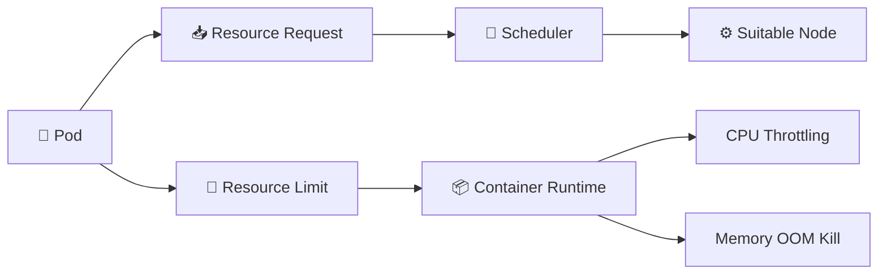

# Resource Requests and Limits 📊

## 1. Overview

Kubernetes allows containers to define **resource requests** and **resource limits** for CPU and memory.

* **Requests** tell the scheduler how much resource a container needs.
* **Limits** define the maximum amount a container may consume.

Requests primarily affect **scheduling**. Limits primarily affect **runtime enforcement**.

This helps Kubernetes place Pods more intelligently and prevents one workload from consuming excessive node resources.

---

## 2. How They Work



---

## 3. Key Concepts

| Resource | Request             | Limit                              |
| -------- | ------------------- | ---------------------------------- |
| CPU      | Used for scheduling | Excess CPU may be throttled        |
| Memory   | Used for scheduling | Exceeding limit may cause OOM kill |

CPU examples:

```text
100m = 0.1 CPU
500m = 0.5 CPU
1 = 1 CPU core
```

Memory examples:

```text
128Mi
512Mi
1Gi
```

---

## 4. Cheat Sheet

View Pod resource configuration:

```bash
kubectl describe pod <pod-name>
```

View node capacity:

```bash
kubectl describe node <node-name>
```

View current usage:

```bash
kubectl top pods
kubectl top nodes
```

View requests and limits:

```bash
kubectl get pod <pod-name> -o yaml
```

---

## 5. Practical Example

Suppose a web container usually needs:

* 250m CPU
* 256Mi memory

but may temporarily require:

* 500m CPU
* 512Mi memory

A reasonable configuration could use the lower values as **requests** and the higher values as **limits**.

The scheduler reserves enough capacity for the request, while the container can temporarily consume more resources up to the defined limits.

---

## 6. YAML Example — Resource Requests

```yaml
apiVersion: v1
kind: Pod
metadata:
  name: web-request
spec:
  containers:
    - name: nginx
      image: nginx:1.27
      resources:
        requests:
          cpu: "250m"
          memory: "256Mi"
```

This Pod requires at least `250m` CPU and `256Mi` memory to be scheduled.

---

## 7. YAML Example — Requests and Limits

```yaml
apiVersion: v1
kind: Pod
metadata:
  name: web-limits
spec:
  containers:
    - name: nginx
      image: nginx:1.27
      resources:
        requests:
          cpu: "250m"
          memory: "256Mi"
        limits:
          cpu: "500m"
          memory: "512Mi"
```

The scheduler uses the requests, while runtime enforcement respects the limits.

---

## 8. Common Problems 🚨

* Requests are too high, causing Pods to remain `Pending`
* Memory limit is too low, causing `OOMKilled`
* CPU limit causes throttling
* Resources are not defined at all
* Requests are much lower than actual usage
* Nodes become overcommitted

---

## 9. Interview Questions 🎯

1. What is the difference between a request and a limit?
2. Which value does the scheduler use?
3. What happens when CPU exceeds its limit?
4. What happens when memory exceeds its limit?
5. What does `500m` CPU mean?
6. Can a container use more CPU than its request?
7. Why are requests important for scheduling?

---

## 10. Related Topics 🔗

* Scheduler
* Pods
* QoS Classes
* LimitRange
* ResourceQuota
* OOMKilled
* Node Capacity
