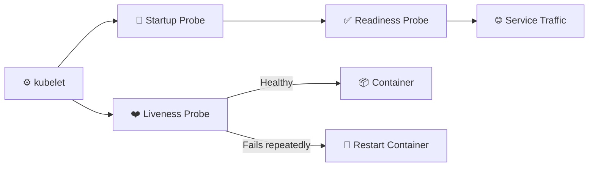

# Health Probes ❤️

## 1. Overview

Kubernetes uses **health probes** to determine whether a container has started correctly, is still functioning, and is ready to receive traffic.

There are three main probe types:

* **Liveness Probe** — checks whether the container is still healthy
* **Readiness Probe** — checks whether the container should receive traffic
* **Startup Probe** — checks whether a slow-starting application has finished starting

These probes are executed by the **kubelet** on the worker node.

---

## 2. Probe Logic



---

## 3. Main Probe Types

| Probe     | Purpose                      | Failure Result                 |
| --------- | ---------------------------- | ------------------------------ |
| Startup   | Confirms application startup | Other probes wait              |
| Readiness | Checks traffic readiness     | Removed from Service endpoints |
| Liveness  | Detects unhealthy container  | Container restarted            |

Common probe mechanisms include:

* HTTP request
* TCP connection
* Command execution
* gRPC health check

---

## 4. Cheat Sheet

Inspect configured probes:

```bash
kubectl describe pod <pod-name>
```

Check Pod readiness:

```bash
kubectl get pods
```

View detailed status:

```bash
kubectl get pods -o wide
```

Check events:

```bash
kubectl get events --sort-by=.metadata.creationTimestamp
```

View application logs:

```bash
kubectl logs <pod-name>
```

---

## 5. Practical Example

Suppose an application process is running, but its internal web server has stopped responding.

Without a liveness probe, Kubernetes may still consider the container alive.

A liveness probe can periodically request the application endpoint. If several checks fail, the kubelet restarts the container.

A readiness probe can separately ensure that traffic is sent only when the application is actually ready.

---

## 6. YAML Example — Liveness and Readiness

```yaml
apiVersion: v1
kind: Pod
metadata:
  name: web
spec:
  containers:
    - name: nginx
      image: nginx:1.27
      livenessProbe:
        httpGet:
          path: /
          port: 80
        periodSeconds: 10

      readinessProbe:
        httpGet:
          path: /
          port: 80
        periodSeconds: 5
```

---

## 7. YAML Example — Startup Probe

```yaml
apiVersion: v1
kind: Pod
metadata:
  name: slow-app
spec:
  containers:
    - name: web
      image: nginx:1.27
      startupProbe:
        httpGet:
          path: /
          port: 80
        periodSeconds: 5
        failureThreshold: 30
```

This gives the application up to approximately 150 seconds to start.

---

## 8. Common Problems 🚨

* Probe path or port is incorrect
* Probe starts too early
* Timeout is too short
* Liveness probe causes restart loops
* Readiness probe prevents Service traffic
* Heavy probe endpoint creates unnecessary load

---

## 9. Interview Questions 🎯

1. What is the difference between liveness and readiness probes?
2. What does a startup probe do?
3. Which component executes probes?
4. What happens when a readiness probe fails?
5. What happens when a liveness probe fails?
6. Why are startup probes useful?
7. Can a running container still be marked unready?

---

## 10. Related Topics 🔗

* kubelet
* Pods
* Services
* Container Lifecycle
* Restart Policy
* Troubleshooting
