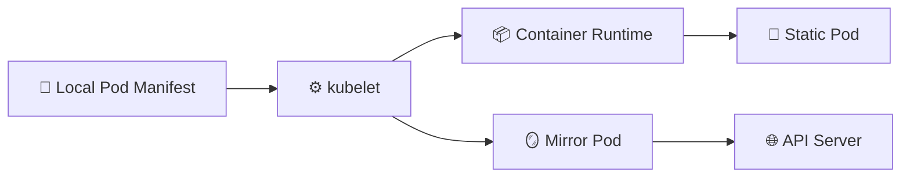

# Static Pods 📌

## 1. Overview

A **Static Pod** is managed directly by the **kubelet** on a specific node instead of being created through the Kubernetes API server.

The kubelet watches a local directory containing Pod manifest files. When it finds a manifest, it starts the Pod and keeps it running.

Static Pods are commonly used for control-plane components in kubeadm-based clusters, such as:

* API Server
* Scheduler
* Controller Manager
* etcd

They are tied to one node and are not scheduled by the Kubernetes Scheduler.

---

## 2. Static Pod Workflow



The API server may display a **mirror Pod**, but the actual Static Pod is still controlled locally by the kubelet.

---

## 3. Key Characteristics

| Feature            | Static Pod                   |
| ------------------ | ---------------------------- |
| Managed by         | kubelet                      |
| Scheduled by       | Not the scheduler            |
| Manifest location  | Local node filesystem        |
| Node placement     | Fixed to one node            |
| API visibility     | Usually through a mirror Pod |
| Controller support | No Deployment or ReplicaSet  |

A common manifest directory is:

```text id="qvnd9o"
/etc/kubernetes/manifests/
```

---

## 4. Cheat Sheet

Find Static Pods:

```bash id="rv70rp"
kubectl get pods -A -o wide
```

Inspect kubelet configuration:

```bash id="zab9r6"
ps aux | grep kubelet
```

Check the Static Pod manifest directory:

```bash id="q8rypw"
ls /etc/kubernetes/manifests/
```

View kubelet logs:

```bash id="j84yp0"
journalctl -u kubelet
```

Inspect a mirror Pod:

```bash id="k85f2s"
kubectl describe pod <pod-name> -n kube-system
```

---

## 5. Practical Example

In a kubeadm control-plane node, you may see files such as:

```text id="tj9d2s"
kube-apiserver.yaml
kube-controller-manager.yaml
kube-scheduler.yaml
etcd.yaml
```

The kubelet monitors these files and starts the corresponding control-plane Pods.

If `kube-apiserver.yaml` is removed from the directory, the kubelet stops managing that Static Pod.

If the file is restored, the kubelet creates it again.

---

## 6. YAML Example

```yaml id="v3hyqg"
apiVersion: v1
kind: Pod
metadata:
  name: static-nginx
spec:
  containers:
    - name: nginx
      image: nginx:1.27
      ports:
        - containerPort: 80
```

If this file is placed in the kubelet’s configured static Pod directory, the kubelet creates and manages the Pod automatically.

---

## 7. Common Problems 🚨

* Manifest stored in the wrong directory
* YAML syntax error
* Container image cannot be pulled
* kubelet service is stopped
* Static Pod is edited through the API instead of locally
* Mirror Pod is mistaken for the actual workload
* Manifest file is accidentally deleted

---

## 8. Interview Questions 🎯

1. What is a Static Pod?
2. Which component manages Static Pods?
3. Does the scheduler place Static Pods?
4. What is a mirror Pod?
5. Where are Static Pod manifests commonly stored?
6. Why are Static Pods used for control-plane components?
7. Can a Static Pod be managed by a Deployment?

---

## 9. Related Topics 🔗

* kubelet
* Control Plane
* Mirror Pods
* API Server
* etcd
* Scheduler
* kubeadm
