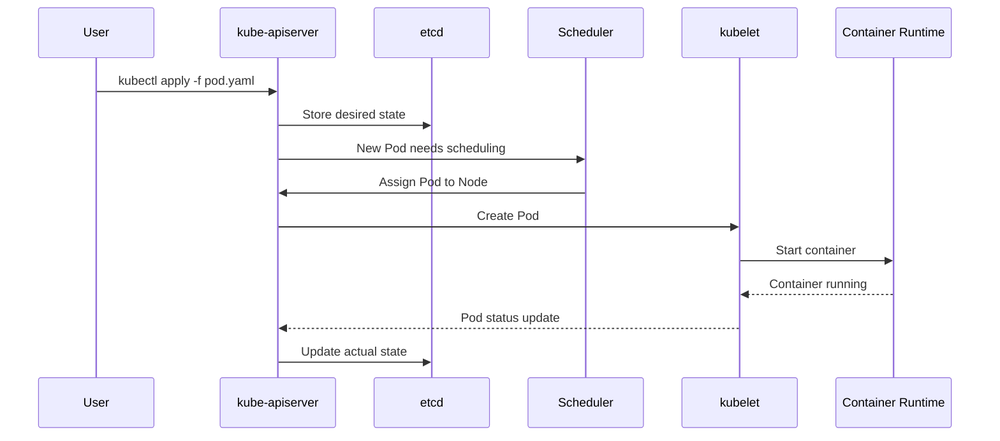

```mermaid
sequenceDiagram

    participant User
    participant API as kube-apiserver
    participant ETCD as etcd
    participant S as Scheduler
    participant K as kubelet
    participant C as Container Runtime

    User->>API: kubectl apply -f pod.yaml
    API->>ETCD: Store desired state
    API->>S: New Pod needs scheduling
    S->>API: Assign Pod to Node
    API->>K: Create Pod
    K->>C: Start container
    C-->>K: Container running
    K-->>API: Pod status update
    API->>ETCD: Update actual state
```
