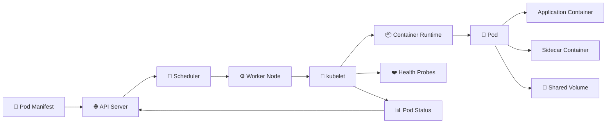

# Pods 🚀

Pods are the smallest deployable units in Kubernetes and provide the environment in which containers run. This folder begins with the basic Pod model, then moves through lifecycle states, multi-container designs, init and sidecar containers, static and ephemeral Pods, resource management, QoS classes, restart behavior, health probes, and troubleshooting. The structure is intentionally broader than the earlier six-file version because several Pod-level concepts deserve their own focused page, but each page will remain short, visual, and information-dense. Scheduling topics such as affinity and anti-affinity are excluded from this folder because they belong more naturally in the dedicated Scheduling chapter. Together, these pages explain how Pods are created, started, monitored, restarted, debugged, and managed on worker nodes without overlapping too heavily with Deployments, Services, or advanced cluster administration. This creates a complete but easy-to-scan foundation before moving into higher-level workload controllers.

## Pod Workflow



## Folder Structure

```text
02-Pods/
├── README.md
├── 01-Pod.md
├── 02-Pod-Lifecycle.md
├── 03-Multi-Container-Pods.md
├── 04-Init-Containers.md
├── 05-Sidecar-Containers.md
├── 06-Static-Pods.md
├── 07-Ephemeral-Containers.md
├── 08-Resource-Requests-and-Limits.md
├── 09-QoS-Classes.md
├── 10-Restart-Policy.md
├── 11-Health-Probes.md
└── 12-Pod-Troubleshooting.md
```
