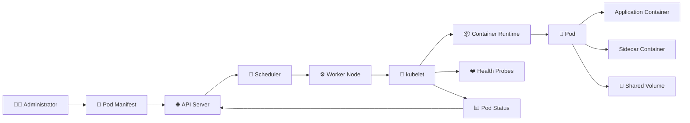

# Pods 🚀

## Overview

A **Pod** is the smallest deployable unit in Kubernetes. It provides the environment in which one or more containers run together on a worker node. Containers inside the same Pod share the Pod’s IP address, network namespace, port space, and any volumes attached to the Pod.

Most Pods contain a single application container. However, Kubernetes also supports multi-container patterns in which supporting containers work closely with the main application. Examples include sidecar containers for logging, proxying, synchronization, or certificate management.

Pods are temporary by design. They may be deleted, recreated, rescheduled, or replaced with a new Pod that has a different name and IP address. For this reason, production Pods are usually managed through higher-level workload controllers such as Deployments, StatefulSets, DaemonSets, Jobs, and CronJobs rather than created manually.

This folder focuses on the main concepts required to understand how Pods are defined, started, scheduled, monitored, and operated.

## Pod Workflow



## Folder Structure

```text
02-Pods/
├── README.md
├── Pod.md
├── Init-Containers.md
├── Multi-Container-Pods.md
├── Sidecar-Containers.md
├── Affinity-and-AntiAffinity.md
├── Resource-Limits.md
├── Health-Probes.md
└── Static-Pods.md
```

## Topics Covered

### `Pod.md`

Introduces the Pod model, its YAML structure, shared networking, attached volumes, container definitions, restart behavior, and common administrative commands.

### `Init-Containers.md`

Covers containers that run before the main application starts. Init containers are commonly used to prepare configuration, wait for dependencies, set permissions, or populate shared volumes.

### `Multi-Container-Pods.md`

Explains how tightly connected containers can run inside the same Pod and communicate through `localhost` or shared storage.

### `Sidecar-Containers.md`

Focuses on supporting containers that remain active beside the main application. Common examples include log collectors, service-mesh proxies, and configuration synchronizers.

### `Affinity-and-AntiAffinity.md`

Introduces rules that influence where Pods are scheduled. Affinity can place workloads near selected nodes or Pods, while anti-affinity can distribute replicas across different nodes or failure domains.

### `Resource-Limits.md`

Covers CPU and memory requests and limits. Requests influence scheduling, while limits control the maximum resources a container may consume.

### `Health-Probes.md`

Explains liveness, readiness, and startup probes. These checks help Kubernetes restart unhealthy containers and prevent unavailable Pods from receiving traffic.

### `Static-Pods.md`

Describes Pods managed directly by the kubelet through local manifest files. Static Pods are commonly used for control-plane components in kubeadm-based clusters.

## Goal

The goal of this folder is to provide a practical understanding of Pods without turning each topic into a long theoretical chapter. Every page follows the same compact structure: overview, Mermaid diagram, cheat sheet, practical example, YAML sample, common problems, interview questions, and related topics.

After completing this folder, the reader should understand how Pods run containers, interact with worker nodes, consume resources, report health, and participate in Kubernetes scheduling.

