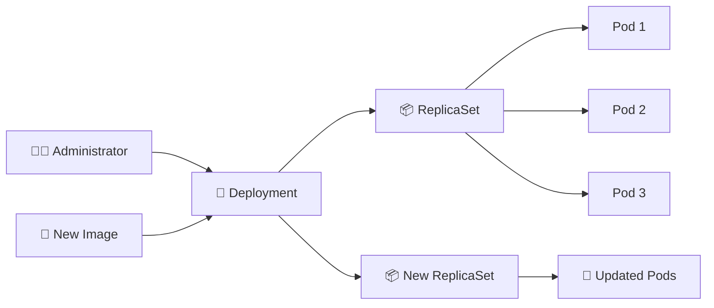

# Deployment 🚀

## 1. Overview

A **Deployment** manages stateless application Pods through ReplicaSets.

Instead of creating Pods manually, an administrator defines the desired number of replicas and the Pod template. Kubernetes then creates and maintains the required Pods.

Deployments are commonly used for:

* Web applications
* APIs
* Microservices
* Stateless backend services

They also support scaling, rolling updates, rollout history, and rollback.

---

## 2. Deployment Relationship



---

## 3. Main Concepts

| Concept        | Purpose                                   |
| -------------- | ----------------------------------------- |
| `replicas`     | Desired number of Pods                    |
| `selector`     | Identifies Pods managed by the Deployment |
| `template`     | Defines the Pods to create                |
| ReplicaSet     | Maintains the required replica count      |
| Rolling Update | Gradually replaces old Pods               |
| Revision       | Represents a Deployment rollout version   |

The Deployment controller continuously compares the desired replica count with the actual number of running Pods.

---

## 4. Cheat Sheet

Create a Deployment:

```bash
kubectl create deployment web --image=nginx
```

Inspect it:

```bash
kubectl get deploy
kubectl describe deploy web
kubectl get pods
kubectl get rs
```

Scale:

```bash
kubectl scale deploy/web --replicas=3
```

Update the image:

```bash
kubectl set image deploy/web nginx=nginx:1.27
```

Monitor rollout:

```bash
kubectl rollout status deploy/web
```

View rollout history:

```bash
kubectl rollout history deploy/web
```

Rollback:

```bash
kubectl rollout undo deploy/web
```

Delete:

```bash
kubectl delete deploy/web
```

---

## 5. Practical Example

Suppose a company runs an NGINX-based frontend and requires three instances for availability.

The administrator creates a Deployment with:

```text
replicas: 3
```

Kubernetes creates a ReplicaSet, which creates three Pods.

If one Pod fails, the ReplicaSet creates a replacement automatically.

If the container image is later changed, the Deployment creates a new ReplicaSet and gradually replaces the old Pods.

---

## 6. YAML Example

```yaml
apiVersion: apps/v1
kind: Deployment
metadata:
  name: web
  labels:
    app: web
spec:
  replicas: 3

  selector:
    matchLabels:
      app: web

  strategy:
    type: RollingUpdate
    rollingUpdate:
      maxUnavailable: 1
      maxSurge: 1

  template:
    metadata:
      labels:
        app: web

    spec:
      containers:
        - name: nginx
          image: nginx:1.27
          ports:
            - containerPort: 80

          resources:
            requests:
              cpu: "100m"
              memory: "128Mi"
            limits:
              cpu: "500m"
              memory: "256Mi"

          readinessProbe:
            httpGet:
              path: /
              port: 80
            initialDelaySeconds: 5
            periodSeconds: 10
```

Apply it:

```bash
kubectl apply -f deployment.yaml
```

---

## 7. Common Problems 🚨

* Deployment selector does not match Pod labels
* Pods remain `Pending`
* New image causes `ImagePullBackOff`
* New version fails readiness checks
* Insufficient resources prevent new Pods from scheduling
* Rollout becomes stuck
* Replica count differs from expectations

---

## 8. Interview Questions 🎯

1. What is a Deployment?
2. What is the relationship between a Deployment and ReplicaSet?
3. Why are Deployments mainly used for stateless applications?
4. What happens when a Deployment Pod is deleted?
5. What triggers a new rollout?
6. How do you scale a Deployment?
7. How do you rollback a failed Deployment?

---

## 9. Related Topics 🔗

* ReplicaSet
* Pods
* Rolling Updates
* Rollback
* Services
* Horizontal Pod Autoscaler
* Readiness Probes
