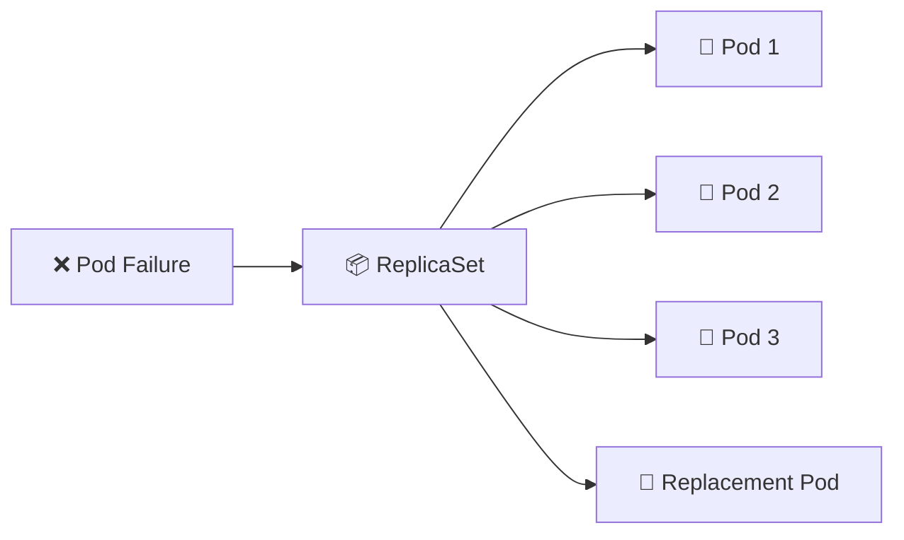

# ReplicaSet 📦

## 1. Overview

A **ReplicaSet** ensures that a specified number of identical Pod replicas are running at all times.

If a Pod fails or is deleted, the ReplicaSet creates a replacement. If too many matching Pods exist, it removes the excess.

ReplicaSets are usually created and managed automatically by **Deployments**, so administrators rarely create them directly in production.

---

## 2. ReplicaSet Workflow



---

## 3. Main Concepts

| Concept    | Purpose                                   |
| ---------- | ----------------------------------------- |
| `replicas` | Desired number of Pods                    |
| `selector` | Identifies Pods managed by the ReplicaSet |
| `template` | Defines newly created Pods                |
| Pod labels | Must match the ReplicaSet selector        |
| Controller | Maintains the requested replica count     |

A ReplicaSet continuously compares:

```text
Desired replicas ↔ Running matching Pods
```

and corrects any difference.

---

## 4. Cheat Sheet

List ReplicaSets:

```bash
kubectl get rs
```

View detailed information:

```bash
kubectl describe rs <replicaset-name>
```

Show associated Pods:

```bash
kubectl get pods -l app=web
```

Scale a ReplicaSet:

```bash
kubectl scale rs/web-rs --replicas=5
```

View YAML:

```bash
kubectl get rs web-rs -o yaml
```

Delete a ReplicaSet:

```bash
kubectl delete rs web-rs
```

View ReplicaSets created by a Deployment:

```bash
kubectl get rs -l app=web
```

---

## 5. Practical Example

Suppose an application must always have three NGINX Pods available.

A ReplicaSet is configured with:

```text
replicas: 3
```

If one Pod crashes or is manually deleted, the ReplicaSet notices that only two matching Pods remain and creates a replacement.

If the replica count is changed to five, two additional Pods are created.

This is the basic mechanism behind Kubernetes replica management.

---

## 6. YAML Example

```yaml
apiVersion: apps/v1
kind: ReplicaSet
metadata:
  name: web-rs
  labels:
    app: web
spec:
  replicas: 3

  selector:
    matchLabels:
      app: web

  template:
    metadata:
      labels:
        app: web
    spec:
      containers:
        - name: nginx
          image: nginx:1.27
          ports:
            - containerPort: 80

          resources:
            requests:
              cpu: "100m"
              memory: "128Mi"
            limits:
              cpu: "500m"
              memory: "256Mi"
```

Apply it:

```bash
kubectl apply -f replicaset.yaml
```

Verify:

```bash
kubectl get rs
kubectl get pods -l app=web
```

---

## 7. Common Problems 🚨

* Selector does not match Pod labels
* Existing Pods are accidentally adopted
* Too many or too few Pods are running
* Pods remain `Pending`
* Image pull failures prevent replicas from becoming ready
* ReplicaSet is manually changed while managed by a Deployment
* Direct ReplicaSet management conflicts with Deployment behavior

---

## 8. Interview Questions 🎯

1. What does a ReplicaSet do?
2. What happens when one ReplicaSet Pod is deleted?
3. What is the purpose of the selector?
4. Why must Pod labels match the selector?
5. What is the difference between a Deployment and ReplicaSet?
6. Should ReplicaSets normally be created manually?
7. How do you scale a ReplicaSet?

---

## 9. Related Topics 🔗

* Deployment
* Pods
* Labels and Selectors
* Scaling
* Rolling Updates
* Controllers
