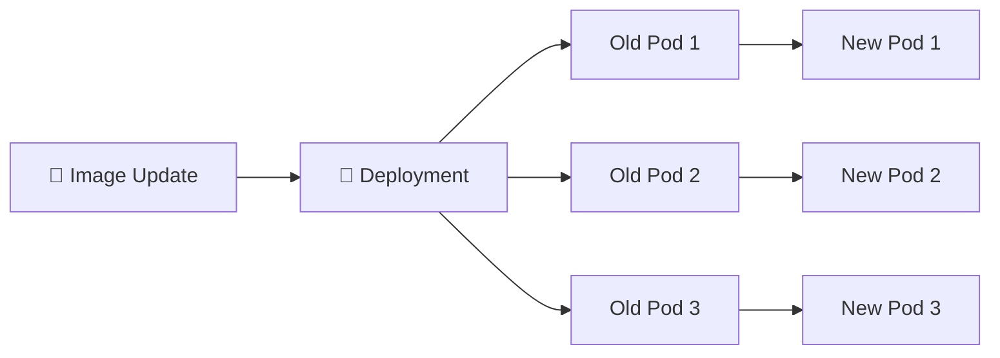

# Rolling Updates 🔄

## 1. Overview

A **Rolling Update** replaces old application Pods gradually with new ones instead of stopping everything at once.

For Deployments, this is the default update strategy.

Rolling updates help reduce downtime by allowing old and new Pods to run together during the transition.

Two important settings control the rollout:

* `maxUnavailable` — how many Pods may be unavailable during the update
* `maxSurge` — how many extra Pods may temporarily exist

---

## 2. Rolling Update Flow



The Deployment creates a new ReplicaSet and gradually scales it up while scaling the old ReplicaSet down.

---

## 3. Main Concepts

| Setting          | Purpose                                         |
| ---------------- | ----------------------------------------------- |
| `RollingUpdate`  | Enables gradual Pod replacement                 |
| `maxUnavailable` | Maximum unavailable Pods during rollout         |
| `maxSurge`       | Maximum extra Pods during rollout               |
| Revision         | Represents a rollout version                    |
| Readiness Probe  | Helps prevent traffic reaching unready new Pods |

---

## 4. Cheat Sheet

Update an image:

```bash id="3x5suv"
kubectl set image deploy/web nginx=nginx:1.28
```

Monitor the rollout:

```bash id="g8e9ac"
kubectl rollout status deploy/web
```

View rollout history:

```bash id="p26f41"
kubectl rollout history deploy/web
```

Inspect ReplicaSets:

```bash id="5ytai1"
kubectl get rs
```

Restart the Deployment:

```bash id="b11d24"
kubectl rollout restart deploy/web
```

Pause and resume:

```bash id="jbj9gx"
kubectl rollout pause deploy/web
kubectl rollout resume deploy/web
```

---

## 5. Practical Example

Suppose a Deployment runs four replicas of:

```text id="fj8a70"
nginx:1.27
```

The image is changed to:

```text id="lvx2e2"
nginx:1.28
```

Kubernetes creates a new ReplicaSet, starts new Pods, waits for them to become ready, and gradually terminates the old Pods.

If the new version fails readiness checks, the rollout may stop progressing instead of replacing all healthy Pods.

---

## 6. YAML Example

```yaml id="9x7khs"
apiVersion: apps/v1
kind: Deployment
metadata:
  name: web
spec:
  replicas: 4

  strategy:
    type: RollingUpdate
    rollingUpdate:
      maxUnavailable: 1
      maxSurge: 1

  selector:
    matchLabels:
      app: web

  template:
    metadata:
      labels:
        app: web
    spec:
      containers:
        - name: nginx
          image: nginx:1.28
          ports:
            - containerPort: 80

          readinessProbe:
            httpGet:
              path: /
              port: 80
            initialDelaySeconds: 5
            periodSeconds: 5
```

With this configuration, Kubernetes may create one extra Pod while allowing at most one desired replica to be unavailable during the rollout.

---

## 7. Common Problems 🚨

* New image cannot be pulled
* Readiness probe fails
* Rollout remains stuck
* Insufficient node resources prevent new Pods from scheduling
* `maxUnavailable` is too aggressive
* Application versions are incompatible during overlap
* New ReplicaSet never becomes healthy

---

## 8. Interview Questions 🎯

1. What is a rolling update?
2. Why are rolling updates useful?
3. What does `maxUnavailable` control?
4. What does `maxSurge` control?
5. What creates the new Pods during an update?
6. How do you monitor rollout progress?
7. What role does a readiness probe play during a rolling update?

---

## 9. Related Topics 🔗

* Deployment
* ReplicaSet
* Rollback
* Readiness Probes
* Blue-Green Deployment
* Canary Deployment
* Scaling
