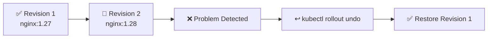

# Rollback ↩️

## 1. Overview

A **rollback** returns a Deployment to a previous revision after a failed or undesirable update.

Kubernetes Deployments keep rollout history by retaining older ReplicaSets. This allows administrators to restore an earlier application version quickly.

Rollback is especially useful when:

* A new image is broken
* Readiness checks fail
* Application errors appear after deployment
* Performance degrades
* A release must be reversed quickly

---

## 2. Rollback Flow



Kubernetes scales an older ReplicaSet back up and scales the problematic one down.

---

## 3. Main Concepts

| Concept         | Purpose                                     |
| --------------- | ------------------------------------------- |
| Revision        | Recorded Deployment rollout                 |
| Rollout history | Shows previous revisions                    |
| Undo            | Restores the previous revision              |
| `--to-revision` | Restores a specific revision                |
| ReplicaSet      | Stores Pod templates from previous rollouts |

Rollbacks apply to the Deployment configuration recorded in rollout history.

---

## 4. Cheat Sheet

View rollout history:

```bash
kubectl rollout history deploy/web
```

Inspect a specific revision:

```bash
kubectl rollout history deploy/web --revision=2
```

Rollback to the previous revision:

```bash
kubectl rollout undo deploy/web
```

Rollback to a specific revision:

```bash
kubectl rollout undo deploy/web --to-revision=1
```

Monitor the rollback:

```bash
kubectl rollout status deploy/web
```

View ReplicaSets:

```bash
kubectl get rs
```

---

## 5. Practical Example

Suppose the `web` Deployment is running:

```text
nginx:1.27
```

The image is updated:

```bash
kubectl set image deploy/web nginx=nginx:1.28
```

After deployment, users begin receiving errors.

The administrator checks the history:

```bash
kubectl rollout history deploy/web
```

and restores the previous working revision:

```bash
kubectl rollout undo deploy/web
```

Kubernetes then recreates Pods using the previous Deployment template.

---

## 6. YAML Example

Initial version:

```yaml
apiVersion: apps/v1
kind: Deployment
metadata:
  name: web
spec:
  replicas: 3
  revisionHistoryLimit: 5
  selector:
    matchLabels:
      app: web
  template:
    metadata:
      labels:
        app: web
    spec:
      containers:
        - name: nginx
          image: nginx:1.27
          ports:
            - containerPort: 80
```

A later update may change:

```yaml
image: nginx:1.28
```

If the new revision fails, Kubernetes can restore the earlier Pod template from rollout history.

---

## 7. Common Problems 🚨

* Rollout history has been removed
* `revisionHistoryLimit` is too low
* Wrong revision is selected
* Old image is no longer available
* Configuration outside the Deployment is incompatible
* Database changes cannot be reversed with a Kubernetes rollback
* Rollback succeeds but application remains unhealthy

---

## 8. Interview Questions 🎯

1. What is a Deployment rollback?
2. How does Kubernetes retain previous revisions?
3. How do you view rollout history?
4. How do you rollback to a specific revision?
5. What does `revisionHistoryLimit` control?
6. Can a rollback reverse database migrations?
7. What happens to ReplicaSets during a rollback?

---

## 9. Related Topics 🔗

* Deployment
* ReplicaSet
* Rolling Updates
* Revision History
* Readiness Probes
* Blue-Green Deployment
* Canary Deployment
