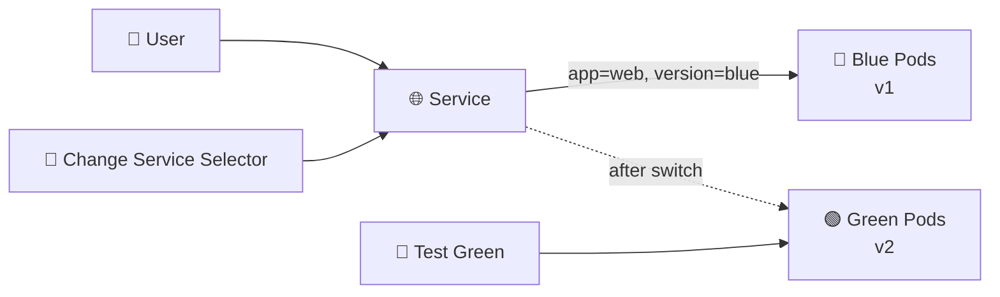

# Blue-Green Deployment 🔵🟢

## 1. Overview

A **Blue-Green Deployment** runs two versions of an application side by side.

* 🔵 **Blue** — current production version
* 🟢 **Green** — new candidate version

Only one version receives production traffic at a time.

After the new version is tested, traffic is switched from Blue to Green by changing the Service selector. If problems appear, traffic can quickly be switched back.

This strategy provides fast rollback, but temporarily requires enough resources to run both versions at the same time.

---

## 2. Traffic Switching



---

## 3. Main Concepts

| Concept          | Purpose                                   |
| ---------------- | ----------------------------------------- |
| Blue             | Current production version                |
| Green            | New application version                   |
| Service selector | Determines which version receives traffic |
| Cutover          | Switching production traffic              |
| Rollback         | Switching traffic back to Blue            |

The key idea is simple:

```text
Deploy Green → Test Green → Switch Traffic → Keep Blue for Rollback
```

---

## 4. Cheat Sheet

View deployments:

```bash
kubectl get deploy
```

View Pods and labels:

```bash
kubectl get pods --show-labels
```

Inspect the Service:

```bash
kubectl get svc web-service -o yaml
```

Switch traffic to Green:

```bash
kubectl patch svc web-service \
  -p '{"spec":{"selector":{"app":"web","version":"green"}}}'
```

Switch back to Blue:

```bash
kubectl patch svc web-service \
  -p '{"spec":{"selector":{"app":"web","version":"blue"}}}'
```

---

## 5. Practical Example

Suppose version `1.0` is currently serving users through the Blue Deployment.

Version `2.0` is deployed separately as Green.

The Green Pods are tested internally. Once they are confirmed healthy, the Service selector is changed from:

```text
version=blue
```

to:

```text
version=green
```

Production traffic immediately begins reaching the Green Pods.

If errors appear, the selector can be changed back to Blue.

---

## 6. YAML Example

```yaml
apiVersion: apps/v1
kind: Deployment
metadata:
  name: web-blue
spec:
  replicas: 3
  selector:
    matchLabels:
      app: web
      version: blue
  template:
    metadata:
      labels:
        app: web
        version: blue
    spec:
      containers:
        - name: web
          image: nginx:1.27
          ports:
            - containerPort: 80
---
apiVersion: apps/v1
kind: Deployment
metadata:
  name: web-green
spec:
  replicas: 3
  selector:
    matchLabels:
      app: web
      version: green
  template:
    metadata:
      labels:
        app: web
        version: green
    spec:
      containers:
        - name: web
          image: nginx:1.28
          ports:
            - containerPort: 80
---
apiVersion: v1
kind: Service
metadata:
  name: web-service
spec:
  selector:
    app: web
    version: blue
  ports:
    - port: 80
      targetPort: 80
```

To move production traffic to Green, change:

```yaml
version: blue
```

to:

```yaml
version: green
```

---

## 7. Common Problems 🚨

* Service selector points to the wrong version
* Green environment is not fully tested
* Insufficient resources to run both environments
* Blue and Green use incompatible databases
* Configuration differs between environments
* Old environment is removed too quickly

---

## 8. Interview Questions 🎯

1. What is a Blue-Green Deployment?
2. How is traffic switched between Blue and Green?
3. What is the main advantage of Blue-Green?
4. What is its main resource disadvantage?
5. How is rollback performed?
6. Why should Blue remain available after cutover?
7. How does Blue-Green differ from a Rolling Update?

---

## 9. Related Topics 🔗

* Deployment
* Services
* Rolling Updates
* Rollback
* Canary Deployment
* Labels and Selectors
* Release Strategies
