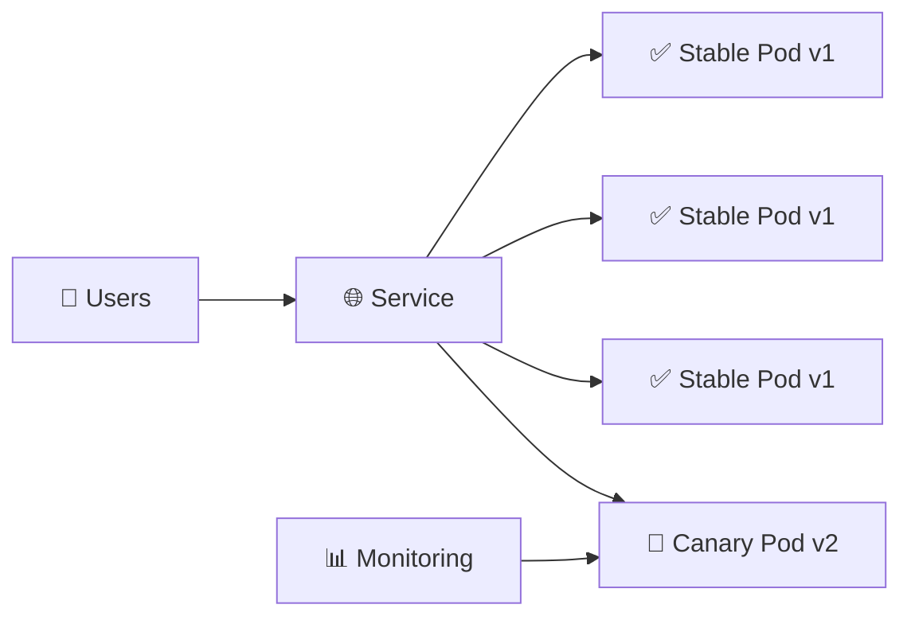

# Canary Deployment 🐤

## 1. Overview

A **Canary Deployment** releases a new application version to a small portion of traffic before making it available to everyone.

The stable version continues serving most users, while a smaller number of canary Pods run the new version.

This allows teams to monitor:

* Error rates
* Performance
* Application logs
* User behavior
* Resource usage

If the canary performs well, its replica count can be increased gradually. If problems appear, the canary can be removed without replacing the stable version.

---

## 2. Canary Traffic Flow



With three stable Pods and one canary Pod, roughly part of the traffic may reach the new version.

---

## 3. Main Concepts

| Concept          | Purpose                                    |
| ---------------- | ------------------------------------------ |
| Stable version   | Current production release                 |
| Canary version   | New version under evaluation               |
| Gradual exposure | Limits risk                                |
| Monitoring       | Determines whether rollout should continue |
| Promotion        | Increase canary traffic                    |
| Rollback         | Remove or scale down the canary            |

A basic progression might look like:

```text
5% → 20% → 50% → 100%
```

---

## 4. Cheat Sheet

View workloads:

```bash
kubectl get deploy
kubectl get pods --show-labels
```

Scale the canary:

```bash
kubectl scale deploy/web-canary --replicas=2
```

Reduce canary traffic:

```bash
kubectl scale deploy/web-canary --replicas=0
```

Inspect both versions:

```bash
kubectl get pods -l app=web -o wide
```

Monitor logs:

```bash
kubectl logs -l version=canary --tail=50
```

---

## 5. Practical Example

Suppose version `1.0` runs with nine replicas.

Version `2.0` is introduced with one canary replica.

Both versions use the same Service selector:

```text
app=web
```

The Service can therefore send traffic to both versions.

If metrics remain healthy, the canary Deployment is gradually scaled up while the stable Deployment is scaled down.

---

## 6. YAML Example

```yaml
apiVersion: apps/v1
kind: Deployment
metadata:
  name: web-stable
spec:
  replicas: 3
  selector:
    matchLabels:
      app: web
      version: stable
  template:
    metadata:
      labels:
        app: web
        version: stable
    spec:
      containers:
        - name: web
          image: nginx:1.27
          ports:
            - containerPort: 80
---
apiVersion: apps/v1
kind: Deployment
metadata:
  name: web-canary
spec:
  replicas: 1
  selector:
    matchLabels:
      app: web
      version: canary
  template:
    metadata:
      labels:
        app: web
        version: canary
    spec:
      containers:
        - name: web
          image: nginx:1.28
          ports:
            - containerPort: 80
---
apiVersion: v1
kind: Service
metadata:
  name: web-service
spec:
  selector:
    app: web
  ports:
    - port: 80
      targetPort: 80
```

Because both Deployments use `app: web`, the Service can send traffic to both stable and canary Pods.

---

## 7. Common Problems 🚨

* Canary receives more traffic than expected
* Monitoring is insufficient
* Stable and canary labels do not match the Service
* New version fails under real traffic
* Database changes are incompatible
* Replica counts do not represent the intended traffic split
* Session persistence distorts distribution

---

## 8. Interview Questions 🎯

1. What is a Canary Deployment?
2. Why is canary safer than replacing all Pods at once?
3. How can replica counts approximate traffic distribution?
4. How do you stop a failed canary?
5. What should be monitored during a canary release?
6. How does Canary differ from Blue-Green?
7. Why might a Service-based canary provide only approximate traffic percentages?

---

## 9. Related Topics 🔗

* Deployment
* Services
* Rolling Updates
* Blue-Green Deployment
* Rollback
* Monitoring
* Ingress
* Service Mesh
