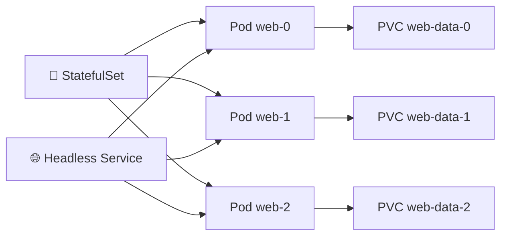

# StatefulSet 💾

## 1. Overview

A **StatefulSet** manages stateful applications that require stable identity, predictable Pod names, and persistent storage.

Unlike Deployment Pods, StatefulSet Pods are not treated as interchangeable replicas.

Typical use cases include:

* Databases
* Message queues
* Distributed storage systems
* Clustered applications

A StatefulSet usually works together with a **Headless Service** and PersistentVolumeClaims.

---

## 2. StatefulSet Model



Each Pod receives a stable ordinal identity such as:

```text
web-0
web-1
web-2
```

---

## 3. Main Concepts

| Concept                | Purpose                             |
| ---------------------- | ----------------------------------- |
| Stable Pod identity    | Predictable Pod names               |
| Ordered startup        | Pods can start in sequence          |
| Ordered termination    | Pods can terminate in reverse order |
| Persistent storage     | Each Pod can receive its own PVC    |
| Headless Service       | Provides stable DNS identity        |
| `volumeClaimTemplates` | Creates PVCs per Pod                |

---

## 4. Cheat Sheet

List StatefulSets:

```bash
kubectl get statefulsets
kubectl get sts
```

Inspect:

```bash
kubectl describe sts web
```

View Pods:

```bash
kubectl get pods -l app=web
```

Scale:

```bash
kubectl scale sts/web --replicas=3
```

View PVCs:

```bash
kubectl get pvc
```

Delete the StatefulSet:

```bash
kubectl delete sts web
```

---

## 5. Practical Example

Suppose PostgreSQL replicas require persistent disks and predictable identities.

A StatefulSet can create:

```text
postgres-0
postgres-1
postgres-2
```

Each Pod receives its own persistent volume.

If `postgres-1` is recreated, Kubernetes keeps the same Pod identity and reconnects it to its existing storage rather than treating it as an entirely unrelated replica.

---

## 6. YAML Example

```yaml
apiVersion: v1
kind: Service
metadata:
  name: web
spec:
  clusterIP: None
  selector:
    app: web
  ports:
    - port: 80
---
apiVersion: apps/v1
kind: StatefulSet
metadata:
  name: web
spec:
  serviceName: web
  replicas: 3

  selector:
    matchLabels:
      app: web

  template:
    metadata:
      labels:
        app: web
    spec:
      containers:
        - name: nginx
          image: nginx:1.27
          ports:
            - containerPort: 80
          volumeMounts:
            - name: web-data
              mountPath: /usr/share/nginx/html

  volumeClaimTemplates:
    - metadata:
        name: web-data
      spec:
        accessModes:
          - ReadWriteOnce
        resources:
          requests:
            storage: 1Gi
```

This creates three Pods and three separate PVCs.

---

## 7. Common Problems 🚨

* PVC remains `Pending`
* StorageClass is missing
* Headless Service is misconfigured
* Pod startup order blocks progress
* Application cannot tolerate ordered startup
* Persistent volumes do not reattach correctly
* StatefulSet is used where a Deployment would be simpler

---

## 8. Interview Questions 🎯

1. What is a StatefulSet?
2. How is it different from a Deployment?
3. Why do StatefulSet Pods have stable names?
4. What is the purpose of a Headless Service?
5. What does `volumeClaimTemplates` do?
6. What happens to storage when a StatefulSet Pod is recreated?
7. When should you choose StatefulSet over Deployment?

---

## 9. Related Topics 🔗

* PersistentVolume
* PersistentVolumeClaim
* StorageClass
* Headless Service
* Deployments
* Databases
* Ordered Scaling
