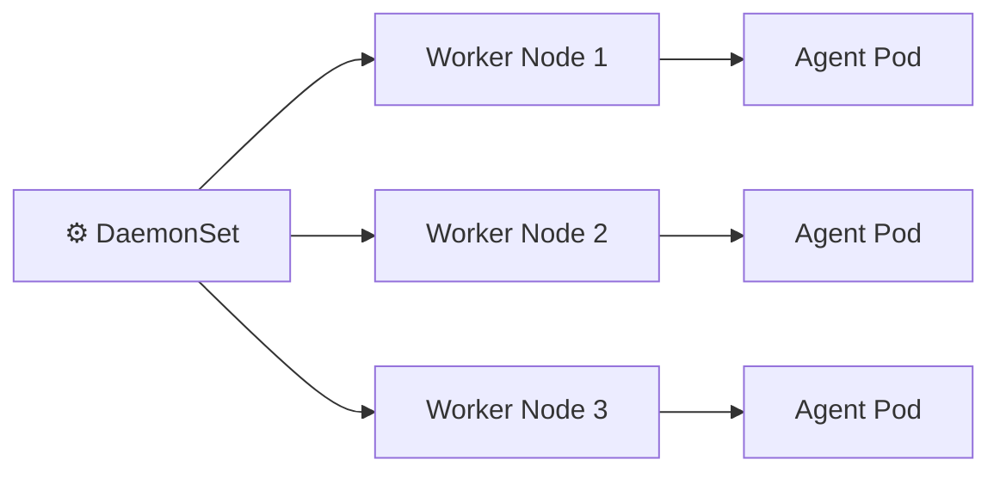

# DaemonSet ⚙️

## 1. Overview

A **DaemonSet** ensures that a copy of a Pod runs on every eligible node, or on a selected group of nodes.

Typical use cases include:

* Log collectors
* Monitoring agents
* Node exporters
* Security agents
* Storage daemons
* Networking components

Unlike a Deployment, where you choose a replica count, a DaemonSet usually creates Pods based on the number of matching nodes.

---

## 2. DaemonSet Model



When a new matching node joins the cluster, the DaemonSet creates a Pod on it automatically.

---

## 3. Main Concepts

| Concept            | Purpose                                 |
| ------------------ | --------------------------------------- |
| One Pod per node   | Common default behavior                 |
| Node selectors     | Limit Pods to selected nodes            |
| Tolerations        | Allow Pods onto tainted nodes           |
| Rolling updates    | Update DaemonSet Pods gradually         |
| Node-level service | Provides functionality tied to the host |

DaemonSets are ideal for software that must operate close to the node itself.

---

## 4. Cheat Sheet

List DaemonSets:

```bash id="8slxdl"
kubectl get daemonsets
kubectl get ds
```

Inspect:

```bash id="u993fs"
kubectl describe ds node-agent
```

View Pods:

```bash id="h0htkn"
kubectl get pods -o wide
```

Update image:

```bash id="o57h1i"
kubectl set image ds/node-agent agent=busybox:1.36
```

Monitor rollout:

```bash id="fieodw"
kubectl rollout status ds/node-agent
```

Restart:

```bash id="x6vpcu"
kubectl rollout restart ds/node-agent
```

Delete:

```bash id="9u2mxw"
kubectl delete ds node-agent
```

---

## 5. Practical Example

Suppose every worker node must expose hardware and operating-system metrics.

Instead of manually deploying one monitoring Pod per node, a DaemonSet can run a metrics agent automatically on each eligible node.

If a fourth worker node is added later, Kubernetes creates the same agent Pod there without changing the DaemonSet configuration.

---

## 6. YAML Example

```yaml id="8aqdso"
apiVersion: apps/v1
kind: DaemonSet
metadata:
  name: node-agent
  namespace: monitoring
spec:
  selector:
    matchLabels:
      app: node-agent

  template:
    metadata:
      labels:
        app: node-agent

    spec:
      containers:
        - name: agent
          image: busybox:1.36
          command:
            - sh
            - -c
            - while true; do echo "monitoring node"; sleep 30; done

          resources:
            requests:
              cpu: "50m"
              memory: "32Mi"
            limits:
              cpu: "100m"
              memory: "64Mi"

      tolerations:
        - operator: Exists
```

This example allows the DaemonSet Pod to tolerate node taints, which can be useful for infrastructure agents.

---

## 7. Common Problems 🚨

* DaemonSet Pod is missing from some nodes
* Node selector excludes intended nodes
* Pod does not tolerate node taints
* Image pull failure occurs on one node
* Host resources or ports conflict
* Rolling update becomes stuck
* DaemonSet runs on control-plane nodes unintentionally

---

## 8. Interview Questions 🎯

1. What is a DaemonSet?
2. How is a DaemonSet different from a Deployment?
3. What happens when a new node joins the cluster?
4. Why are DaemonSets useful for monitoring agents?
5. How do taints and tolerations affect DaemonSets?
6. Can a DaemonSet run only on selected nodes?
7. How are DaemonSet Pods updated?

---

## 9. Related Topics 🔗

* Worker Nodes
* Node Exporter
* Logging Agents
* Taints and Tolerations
* Node Selectors
* Rolling Updates
* Monitoring
