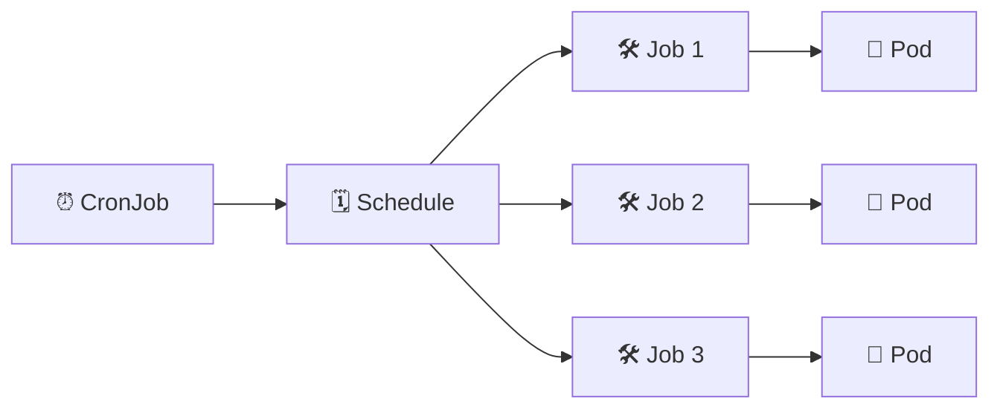

# CronJobs ⏰

## 1. Overview

A **CronJob** creates Jobs on a repeating schedule.

It is useful for workloads that must run automatically at specific times, such as:

* Backups
* Report generation
* Database cleanup
* Log rotation
* Periodic synchronization
* Scheduled maintenance

CronJobs use standard cron-style scheduling syntax.

---

## 2. CronJob Workflow



A CronJob does not directly run Pods. It creates **Jobs**, and those Jobs create Pods.

---

## 3. Main Concepts

| Concept                      | Purpose                       |
| ---------------------------- | ----------------------------- |
| `schedule`                   | Defines when the Job runs     |
| `jobTemplate`                | Defines the Job to create     |
| `concurrencyPolicy`          | Controls overlapping Jobs     |
| `suspend`                    | Temporarily disables new runs |
| `successfulJobsHistoryLimit` | Keeps completed Job history   |
| `failedJobsHistoryLimit`     | Keeps failed Job history      |

Cron format:

```text
minute hour day-of-month month day-of-week
```

Example:

```text
0 2 * * *
```

Runs every day at 02:00.

---

## 4. Cheat Sheet

Create a CronJob:

```bash
kubectl create cronjob backup \
  --image=busybox \
  --schedule="0 2 * * *" \
  -- echo "Running backup"
```

List CronJobs:

```bash
kubectl get cronjobs
kubectl get cj
```

Inspect:

```bash
kubectl describe cronjob backup
```

View Jobs created by CronJobs:

```bash
kubectl get jobs
```

Suspend:

```bash
kubectl patch cronjob backup \
  -p '{"spec":{"suspend":true}}'
```

Resume:

```bash
kubectl patch cronjob backup \
  -p '{"spec":{"suspend":false}}'
```

Delete:

```bash
kubectl delete cronjob backup
```

---

## 5. Practical Example

Suppose a database backup must run every night at 02:00.

A CronJob can create a Job automatically at that time.

The Job starts a Pod, executes the backup command, and exits when the task is complete.

The following night, the CronJob creates a new Job and repeats the process.

This avoids external schedulers or manual execution.

---

## 6. YAML Example

```yaml
apiVersion: batch/v1
kind: CronJob
metadata:
  name: nightly-backup
spec:
  schedule: "0 2 * * *"
  concurrencyPolicy: Forbid
  successfulJobsHistoryLimit: 3
  failedJobsHistoryLimit: 1

  jobTemplate:
    spec:
      backoffLimit: 2

      template:
        spec:
          restartPolicy: Never

          containers:
            - name: backup
              image: busybox:1.36
              command:
                - sh
                - -c
                - |
                  echo "Starting backup..."
                  date
                  sleep 5
                  echo "Backup completed"
```

Apply it:

```bash
kubectl apply -f cronjob.yaml
```

---

## 7. Common Problems 🚨

* Incorrect cron expression
* CronJob runs at an unexpected time
* Previous Job overlaps with the next run
* Job repeatedly fails
* Too many completed Jobs accumulate
* CronJob is accidentally suspended
* Container image cannot be pulled

---

## 8. Interview Questions 🎯

1. What is a Kubernetes CronJob?
2. What does a CronJob create?
3. How is a CronJob different from a Job?
4. What does `concurrencyPolicy` control?
5. What does `suspend` do?
6. How do you schedule a Job every day at 02:00?
7. Why are Job history limits useful?

---

## 9. Related Topics 🔗

* Job
* Pods
* Batch Processing
* Scheduling
* Backups
* Restart Policy
* Job Cleanup
