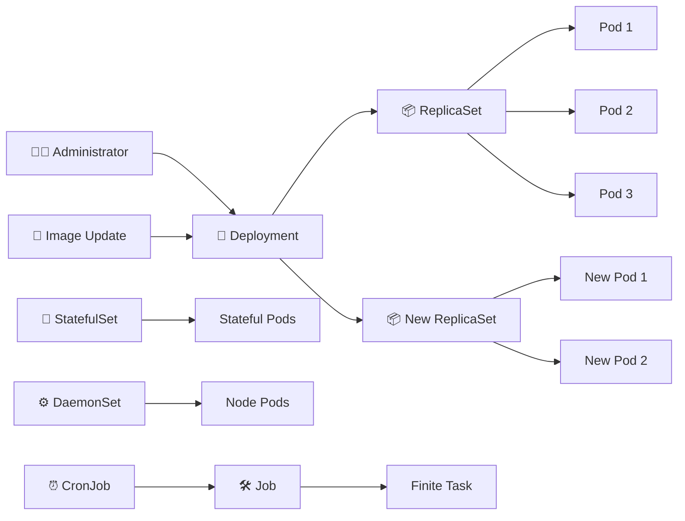

# Kubernetes Workloads 🚀

## Overview

Kubernetes **workloads** are controllers used to create, maintain, scale, update, and recover application Pods.

Rather than managing individual Pods manually, administrators usually define a higher-level workload object. Kubernetes then continuously works to keep the running environment aligned with the desired state.

The most common workload controller is the **Deployment**, which is designed primarily for stateless applications. Kubernetes also provides specialized controllers for stateful applications, node-level workloads, batch processing, and scheduled jobs.

This folder covers:

```text
03-Workloads/
├── README.md
├── Deployment.md
├── ReplicaSet.md
├── Rolling-Updates.md
├── Rollback.md
├── Blue-Green-Deployment.md
├── Canary-Deployment.md
├── StatefulSet.md
├── DaemonSet.md
├── Job.md
└── CronJob.md
```

---

## Workload Relationships



---

## Deployment Basics

Create a Deployment:

```bash
kubectl create deployment web --image=nginx
```

Inspect Deployments:

```bash
kubectl get deploy
kubectl describe deploy web
```

Scale the Deployment:

```bash
kubectl scale deploy web --replicas=3
```

Update the application image:

```bash
kubectl set image deploy web app=nginx:1.25.5
```

Monitor the rollout:

```bash
kubectl rollout status deploy web
```

Rollback if necessary:

```bash
kubectl rollout undo deploy web
```

A Deployment normally manages one or more **ReplicaSets**, which in turn maintain the required number of Pods.

---

## Main Workload Types

| Workload    | Primary Purpose                                 |
| ----------- | ----------------------------------------------- |
| Deployment  | Stateless applications                          |
| ReplicaSet  | Maintains a desired number of Pod replicas      |
| StatefulSet | Stateful applications requiring stable identity |
| DaemonSet   | Runs Pods on selected nodes                     |
| Job         | Executes a task until completion                |
| CronJob     | Runs Jobs on a schedule                         |

Deployment strategies such as **Rolling Updates**, **Blue-Green**, and **Canary deployments** provide different approaches for safely introducing new application versions.

---

# ⚡ CHEAT SHEET

### Create / Inspect

```bash
kubectl create deployment web --image=nginx
kubectl get deploy
kubectl describe deploy web
kubectl get rs -l app=web                         # ReplicaSets created by the Deployment
```

### Scale

```bash
kubectl scale deploy/web --replicas=3
kubectl autoscale deploy/web --min=2 --max=5 --cpu-percent=70   # HPA
```

### Update Image — Triggers Rolling Update

```bash
kubectl set image deploy/web app=nginx:1.25.5
kubectl rollout status deploy/web
kubectl rollout history deploy/web
kubectl rollout undo deploy/web
kubectl rollout undo deploy/web --to-revision=1
```

### Pause / Resume Rollouts

Useful when several fields need to be modified before triggering the next rollout:

```bash
kubectl rollout pause deploy/web

kubectl set resources deploy/web \
  -c app \
  --limits=cpu=500m,memory=256Mi

kubectl rollout resume deploy/web
```

### YAML Workflow

Generate a Deployment manifest:

```bash
kubectl create deploy api \
  --image=nginx \
  --dry-run=client \
  -o yaml > deploy.yaml
```

Apply it:

```bash
kubectl apply -f deploy.yaml
```

Delete a Deployment:

```bash
kubectl delete deploy web
```

### Additional Useful Commands

```bash
kubectl get deploy -o wide
kubectl get deploy web -o yaml

kubectl edit deploy web

kubectl get pods -l app=web
kubectl get rs

kubectl rollout restart deploy/web

kubectl rollout history deploy/web
kubectl rollout status deploy/web

kubectl scale deploy/web --replicas=5

kubectl delete deploy/web
```
