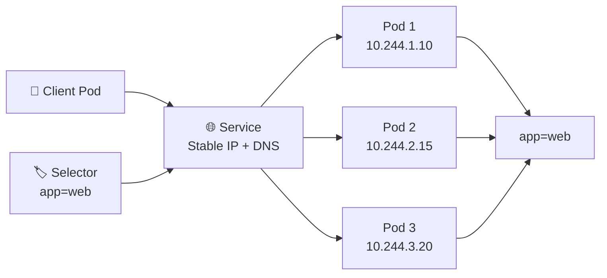

# Pod Networking and Services 🌐

## 1. Overview

Every Kubernetes Pod receives its own IP address and can communicate with other reachable Pods across the cluster.

However, Pod IP addresses are **temporary**. When a Pod is deleted and recreated, the replacement may receive a different IP.

A **Service** solves this problem by providing a stable IP address and DNS name in front of a group of Pods.

Services normally identify their backend Pods using **labels and selectors**.

---

## 2. Networking Flow



The client communicates with the **Service**, not with individual Pod IP addresses.

---

## 3. Key Concepts

| Concept       | Purpose                                |
| ------------- | -------------------------------------- |
| Pod IP        | Address assigned to an individual Pod  |
| Service       | Stable network endpoint for Pods       |
| Selector      | Identifies backend Pods through labels |
| `port`        | Port exposed by the Service            |
| `targetPort`  | Port used by the application container |
| DNS           | Allows Services to be accessed by name |
| EndpointSlice | Tracks backend Pod endpoints           |

Common Service types include:

* `ClusterIP`
* `NodePort`
* `LoadBalancer`
* `ExternalName`

---

## 4. Cheat Sheet

View Pod IP addresses:

```bash
kubectl get pods -o wide
```

List Services:

```bash
kubectl get svc
```

Inspect a Service:

```bash
kubectl describe svc web-service
```

View backend endpoints:

```bash
kubectl get endpointslices
```

Expose a Deployment:

```bash
kubectl expose deployment web \
  --name=web-service \
  --port=80 \
  --target-port=8080
```

Test DNS from a Pod:

```bash
kubectl exec -it <pod-name> -- nslookup web-service
```

---

## 5. Practical Example

Suppose a Deployment runs three web Pods.

Their addresses might be:

```text
10.244.1.10
10.244.2.15
10.244.3.20
```

Rather than configuring clients with those addresses, Kubernetes creates a Service such as:

```text
web-service → 10.96.20.10
```

Applications connect to `web-service`, while Kubernetes forwards traffic to one of the matching backend Pods.

If a Pod is replaced, the Service remains unchanged.

---

## 6. YAML Example

```yaml
apiVersion: v1
kind: Service
metadata:
  name: web-service
spec:
  selector:
    app: web

  ports:
    - protocol: TCP
      port: 80
      targetPort: 8080

  type: ClusterIP
```

This Service selects Pods containing:

```yaml
labels:
  app: web
```

Traffic sent to Service port `80` is forwarded to port `8080` on matching Pods.

---

## 7. Common Problems 🚨

* Service selector does not match Pod labels
* `targetPort` does not match the application port
* Pods are not Ready
* EndpointSlice contains no backend Pods
* DNS resolution fails
* CNI networking is broken
* NetworkPolicy blocks traffic

---

## 8. Interview Questions 🎯

1. Why do Kubernetes Services exist?
2. Why should applications avoid relying directly on Pod IPs?
3. What is the difference between `port` and `targetPort`?
4. How does a Service identify its backend Pods?
5. What happens to a Service when a Pod is recreated?
6. What is an EndpointSlice?
7. How does Kubernetes provide Service discovery?

---

## 9. Related Topics 🔗

* ClusterIP
* NodePort
* LoadBalancer
* DNS and CoreDNS
* EndpointSlice
* Labels and Selectors
* CNI
* NetworkPolicy
