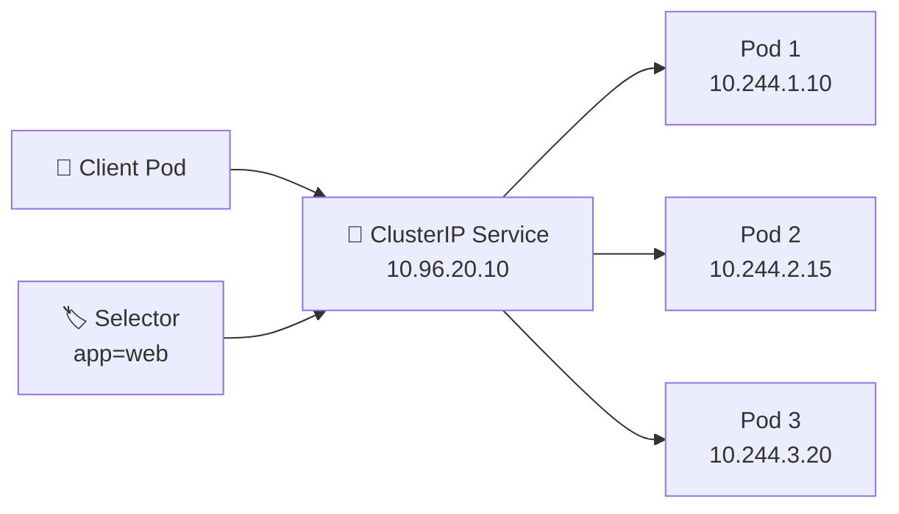

# ClusterIP 🔗

## 1. Overview

A **ClusterIP Service** exposes an application on a stable virtual IP address that is reachable **inside the Kubernetes cluster**.

It is the default Service type.

ClusterIP is commonly used for internal communication between application components such as:

* Frontend → Backend
* API → Database
* Application → Cache
* Microservice → Microservice

Because Pods can be recreated with new IP addresses, the ClusterIP provides a stable endpoint in front of them.

---

## 2. Traffic Flow



The client connects to the Service rather than individual Pod IP addresses.

---

## 3. Key Concepts

| Concept       | Purpose                              |
| ------------- | ------------------------------------ |
| `clusterIP`   | Stable virtual IP inside the cluster |
| `selector`    | Identifies backend Pods              |
| `port`        | Port exposed by the Service          |
| `targetPort`  | Port used by the application         |
| EndpointSlice | Tracks matching backend Pod IPs      |
| DNS           | Allows access by Service name        |

A ClusterIP is generally not directly reachable from outside the cluster.

---

## 4. Cheat Sheet

Create a ClusterIP Service:

```bash
kubectl expose deployment web \
  --name=web-service \
  --type=ClusterIP \
  --port=80 \
  --target-port=8080
```

List Services:

```bash
kubectl get svc
```

Inspect:

```bash
kubectl describe svc web-service
```

View Service IP:

```bash
kubectl get svc web-service -o wide
```

View backend endpoints:

```bash
kubectl get endpointslices
```

Test from another Pod:

```bash
kubectl exec -it <pod-name> -- curl web-service
```

---

## 5. Practical Example

Suppose three backend Pods listen on port `8080`.

Their Pod IP addresses may change over time, but a ClusterIP Service exposes them through:

```text
backend-service:80
```

A frontend application can therefore connect to:

```text
http://backend-service
```

without knowing which backend Pod receives the request.

Kubernetes DNS resolves the Service name, while Service networking directs the connection to an available backend.

---

## 6. YAML Example

```yaml
apiVersion: v1
kind: Service
metadata:
  name: backend-service
spec:
  type: ClusterIP

  selector:
    app: backend

  ports:
    - name: http
      protocol: TCP
      port: 80
      targetPort: 8080
```

Matching Pods must contain:

```yaml
metadata:
  labels:
    app: backend
```

Traffic arriving at Service port `80` is sent to port `8080` on one of the matching Pods.

---

## 7. Common Problems 🚨

* Selector does not match Pod labels
* Service has no endpoints
* `targetPort` is incorrect
* Application is not listening on the expected port
* Pods are not Ready
* NetworkPolicy blocks traffic
* DNS resolution fails

---

## 8. Interview Questions 🎯

1. What is a ClusterIP Service?
2. Is ClusterIP reachable directly from outside the cluster?
3. Why is ClusterIP the default Service type?
4. What is the difference between `port` and `targetPort`?
5. How does a ClusterIP find its backend Pods?
6. What happens when backend Pods are recreated?
7. How can another Pod access a ClusterIP Service?

---

## 9. Related Topics 🔗

* Services
* Pod Networking
* NodePort
* LoadBalancer
* EndpointSlice
* CoreDNS
* NetworkPolicy
