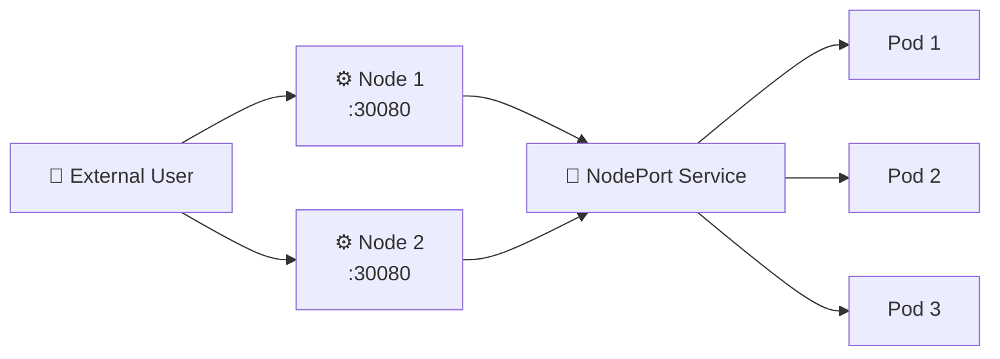

# NodePort 🔌

## 1. Overview

A **NodePort Service** exposes an application on a static port on each Kubernetes node.

External clients can reach the Service using:

```text
<NodeIP>:<NodePort>
```

NodePort is useful for:

* Development and testing
* Small clusters
* Bare-metal environments
* Situations without an external load balancer

By default, Kubernetes allocates NodePorts from the range:

```text
30000-32767
```

---

## 2. Traffic Flow



The client can normally use the NodePort on any reachable node, while Kubernetes forwards the connection to a matching backend Pod.

---

## 3. Key Concepts

| Concept      | Purpose                             |
| ------------ | ----------------------------------- |
| `nodePort`   | Port exposed on cluster nodes       |
| `port`       | Service port inside the cluster     |
| `targetPort` | Application port on the Pod         |
| `selector`   | Identifies backend Pods             |
| Node IP      | Address external clients connect to |

A NodePort Service also receives a ClusterIP internally.

---

## 4. Cheat Sheet

Create a NodePort Service:

```bash
kubectl expose deployment web \
  --name=web-service \
  --type=NodePort \
  --port=80 \
  --target-port=8080
```

List Services:

```bash
kubectl get svc
```

Inspect:

```bash
kubectl describe svc web-service
```

View allocated NodePort:

```bash
kubectl get svc web-service -o wide
```

View node addresses:

```bash
kubectl get nodes -o wide
```

Test:

```bash
curl http://<node-ip>:<node-port>
```

---

## 5. Practical Example

Suppose an NGINX application listens on port `80` inside its Pods.

A NodePort Service exposes it as:

```text
NodePort: 30080
```

If a worker node has the IP:

```text
192.168.1.50
```

the application may be reached at:

```text
http://192.168.1.50:30080
```

The client does not need to know the Pod IP addresses.

---

## 6. YAML Example

```yaml
apiVersion: v1
kind: Service
metadata:
  name: web-nodeport
spec:
  type: NodePort

  selector:
    app: web

  ports:
    - name: http
      protocol: TCP
      port: 80
      targetPort: 80
      nodePort: 30080
```

Traffic follows:

```text
NodeIP:30080
      ↓
Service:80
      ↓
Pod:80
```

---

## 7. Common Problems 🚨

* Node firewall blocks the NodePort
* Wrong node IP is used
* Service selector matches no Pods
* `targetPort` is incorrect
* NodePort is outside the allowed range
* Application is listening only on the wrong interface
* NetworkPolicy or external firewall blocks traffic

---

## 8. Interview Questions 🎯

1. What is a NodePort Service?
2. What is the default NodePort range?
3. What is the difference between `nodePort`, `port`, and `targetPort`?
4. Does a NodePort Service also have a ClusterIP?
5. Can the same NodePort normally be reached through multiple nodes?
6. When would you use NodePort?
7. Why is NodePort less common for production internet-facing applications?

---

## 9. Related Topics 🔗

* ClusterIP
* LoadBalancer
* Services
* kube-proxy
* Ingress
* External Load Balancers
* Firewalls
