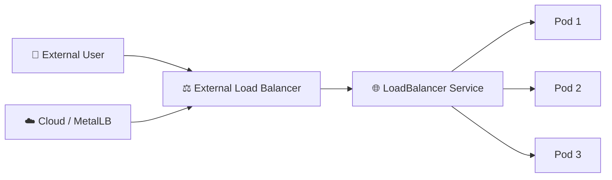

# LoadBalancer ⚖️

## 1. Overview

A **LoadBalancer Service** exposes a Kubernetes application externally through a load balancer provided by the underlying infrastructure.

It is commonly used in:

* Public cloud environments
* Managed Kubernetes platforms
* Bare-metal clusters with tools such as MetalLB
* Production services that need a stable external IP

A LoadBalancer Service usually builds on top of a ClusterIP and may also allocate a NodePort internally, depending on the implementation.

---

## 2. Traffic Flow



The external load balancer receives traffic and forwards it into the Kubernetes Service.

---

## 3. Key Concepts

| Concept              | Purpose                                       |
| -------------------- | --------------------------------------------- |
| External IP          | Address reachable by clients                  |
| `type: LoadBalancer` | Requests external exposure                    |
| ClusterIP            | Internal Service address                      |
| NodePort             | May be used internally                        |
| Provider integration | Creates or assigns the external load balancer |

On cloud platforms, Kubernetes may automatically provision a load balancer.

On bare metal, an implementation such as **MetalLB** is commonly required.

---

## 4. Cheat Sheet

Create a LoadBalancer Service:

```bash
kubectl expose deployment web \
  --name=web-lb \
  --type=LoadBalancer \
  --port=80 \
  --target-port=8080
```

List Services:

```bash
kubectl get svc
```

Watch for external IP assignment:

```bash
kubectl get svc web-lb -w
```

Inspect:

```bash
kubectl describe svc web-lb
```

View endpoints:

```bash
kubectl get endpointslices
```

Test:

```bash
curl http://<external-ip>
```

---

## 5. Practical Example

Suppose a web application runs behind three Pods.

A LoadBalancer Service exposes them using:

```text
203.0.113.20
```

External clients connect to:

```text
http://203.0.113.20
```

The external load balancer sends traffic into the Kubernetes Service, which then forwards requests to one of the healthy backend Pods.

If Pods are recreated, the external IP remains stable.

---

## 6. YAML Example

```yaml
apiVersion: v1
kind: Service
metadata:
  name: web-lb
spec:
  type: LoadBalancer

  selector:
    app: web

  ports:
    - name: http
      protocol: TCP
      port: 80
      targetPort: 8080
```

Matching Pods should contain:

```yaml
metadata:
  labels:
    app: web
```

Traffic follows:

```text
External IP
    ↓
LoadBalancer Service:80
    ↓
Pod:8080
```

---

## 7. Common Problems 🚨

* External IP remains `Pending`
* Cloud provider integration is missing
* MetalLB is not installed on bare metal
* Service selector matches no Pods
* `targetPort` is incorrect
* Firewall or security group blocks traffic
* Load balancer health checks fail

---

## 8. Interview Questions 🎯

1. What is a LoadBalancer Service?
2. How is it different from NodePort?
3. What happens when no load balancer implementation exists?
4. What does `EXTERNAL-IP: <pending>` usually indicate?
5. Does a LoadBalancer Service also have a ClusterIP?
6. How can bare-metal Kubernetes provide LoadBalancer Services?
7. What role does the external provider play?

---

## 9. Related Topics 🔗

* ClusterIP
* NodePort
* Services
* Ingress
* MetalLB
* Cloud Controller Manager
* External Load Balancers
