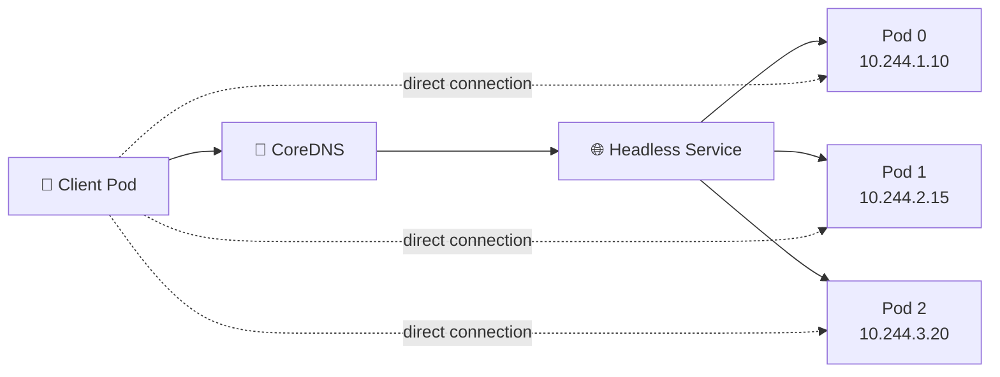

# Headless Service 🧭

## 1. Overview

A **Headless Service** is a Kubernetes Service created with:

```yaml
clusterIP: None
```

Unlike a normal ClusterIP Service, it does not provide one virtual Service IP.

Instead, DNS queries can return the individual Pod IP addresses behind the Service. This is useful when applications need to discover and communicate with specific Pods directly.

Typical use cases include:

* StatefulSets
* Databases
* Distributed systems
* Clustered applications
* Peer-to-peer communication

---

## 2. Traffic and DNS Flow



The client discovers individual backend addresses rather than connecting through one virtual IP.

---

## 3. Key Concepts

| Concept           | Purpose                              |
| ----------------- | ------------------------------------ |
| `clusterIP: None` | Disables the virtual ClusterIP       |
| DNS discovery     | Returns backend addresses            |
| Direct Pod access | Clients can connect to specific Pods |
| Stateful identity | Works well with StatefulSets         |
| Selector          | Identifies the backend Pods          |

A Headless Service is primarily about **service discovery**, not Service-level load balancing.

---

## 4. Cheat Sheet

List Services:

```bash
kubectl get svc
```

Identify a Headless Service:

```bash
kubectl get svc <service-name> -o wide
```

You should see:

```text
CLUSTER-IP   None
```

Inspect it:

```bash
kubectl describe svc <service-name>
```

View backend endpoints:

```bash
kubectl get endpointslices
```

Test DNS:

```bash
kubectl exec -it <pod-name> -- nslookup <service-name>
```

---

## 5. Practical Example

Suppose a StatefulSet creates:

```text
postgres-0
postgres-1
postgres-2
```

A normal Service would hide those Pods behind one ClusterIP.

A Headless Service allows clients to discover the individual Pods, which is useful when database replicas must communicate with specific peers.

With a StatefulSet, stable DNS names can look like:

```text
postgres-0.postgres
postgres-1.postgres
postgres-2.postgres
```

---

## 6. YAML Example

```yaml
apiVersion: v1
kind: Service
metadata:
  name: postgres
spec:
  clusterIP: None

  selector:
    app: postgres

  ports:
    - name: postgres
      port: 5432
      targetPort: 5432
```

Matching Pods should contain:

```yaml
metadata:
  labels:
    app: postgres
```

The Service does not receive a virtual IP; DNS exposes the matching endpoints instead.

---

## 7. Common Problems 🚨

* `clusterIP: None` is missing
* Service selector matches no Pods
* DNS returns no endpoints
* Pods are not Ready
* StatefulSet `serviceName` does not match
* Application expects load balancing instead of direct discovery

---

## 8. Interview Questions 🎯

1. What is a Headless Service?
2. What does `clusterIP: None` mean?
3. Does a Headless Service have a virtual ClusterIP?
4. Why are Headless Services commonly used with StatefulSets?
5. How do clients discover backend Pods?
6. Does a Headless Service perform normal Service load balancing?
7. How are stable StatefulSet DNS names formed?

---

## 9. Related Topics 🔗

* StatefulSet
* ClusterIP
* DNS and CoreDNS
* EndpointSlice
* Service Discovery
* Persistent Storage
