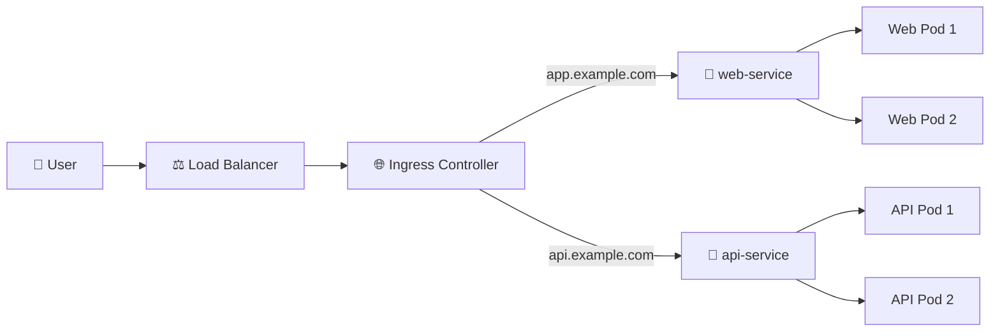

# Ingress 🌐

## 1. Overview

An **Ingress** defines HTTP and HTTPS routing rules for traffic entering a Kubernetes cluster.

Instead of exposing every application with its own NodePort or LoadBalancer Service, Ingress can route multiple domains or URL paths through a shared external entry point.

Typical use cases include:

* `app.example.com` → frontend Service
* `api.example.com` → API Service
* `/shop` → shop Service
* `/admin` → admin Service
* TLS termination for HTTPS

An Ingress resource defines the rules, while an **Ingress Controller** actually implements them.

---

## 2. Traffic Flow



Ingress normally routes traffic to Kubernetes **Services**, not directly to Pods.

---

## 3. Key Concepts

| Concept            | Purpose                               |
| ------------------ | ------------------------------------- |
| Ingress            | Defines routing rules                 |
| Ingress Controller | Implements those rules                |
| Host routing       | Routes based on domain name           |
| Path routing       | Routes based on URL path              |
| Backend Service    | Destination for traffic               |
| TLS                | Enables HTTPS                         |
| IngressClass       | Selects the controller implementation |

Ingress primarily operates at **Layer 7**, handling HTTP and HTTPS traffic.

---

## 4. Cheat Sheet

List Ingress resources:

```bash id="6j69cz"
kubectl get ingress
kubectl get ing
```

Inspect an Ingress:

```bash id="cnkpmb"
kubectl describe ingress web-ingress
```

View YAML:

```bash id="jgnfon"
kubectl get ingress web-ingress -o yaml
```

List IngressClasses:

```bash id="723byl"
kubectl get ingressclass
```

Check backend Services:

```bash id="wa4b0m"
kubectl get svc
```

Test host routing:

```bash id="h83f75"
curl -H "Host: app.example.com" http://<ingress-ip>
```

---

## 5. Practical Example

Suppose a cluster contains two applications:

```text id="c7dr56"
web-service
api-service
```

Instead of creating two external load balancers, one Ingress can route:

```text id="x5l9pr"
app.example.com → web-service
api.example.com → api-service
```

Both applications share the same external entry point while maintaining separate routing rules.

---

## 6. YAML Example

```yaml id="8d4hwx"
apiVersion: networking.k8s.io/v1
kind: Ingress
metadata:
  name: application-ingress
spec:
  ingressClassName: nginx

  rules:
    - host: app.example.com
      http:
        paths:
          - path: /
            pathType: Prefix
            backend:
              service:
                name: web-service
                port:
                  number: 80

    - host: api.example.com
      http:
        paths:
          - path: /
            pathType: Prefix
            backend:
              service:
                name: api-service
                port:
                  number: 80
```

The Ingress Controller reads these rules and sends incoming requests to the appropriate Service.

---

## 7. Common Problems 🚨

* No Ingress Controller is installed
* Incorrect `ingressClassName`
* DNS does not point to the Ingress endpoint
* Backend Service name or port is wrong
* Service has no healthy endpoints
* TLS Secret is missing or invalid
* Path matching behaves differently than expected

---

## 8. Interview Questions 🎯

1. What is Kubernetes Ingress?
2. Does an Ingress work without an Ingress Controller?
3. What is the difference between host-based and path-based routing?
4. Does Ingress normally send traffic directly to Pods?
5. What is an IngressClass?
6. How can Ingress provide HTTPS?
7. Why use Ingress instead of multiple LoadBalancer Services?

---

## 9. Related Topics 🔗

* Ingress Controller
* Services
* LoadBalancer
* DNS and CoreDNS
* TLS Secrets
* cert-manager
* Gateway API
