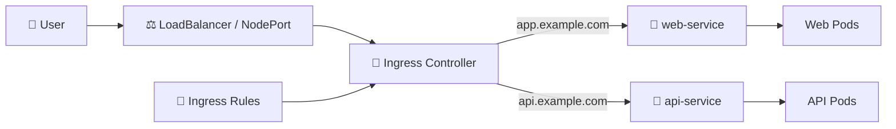

# Ingress Controller 🚦

## 1. Overview

An **Ingress Controller** is the component that actually reads Kubernetes Ingress rules and routes incoming HTTP/HTTPS traffic.

The Ingress object only defines routing rules. Without a controller, those rules do nothing.

Common Ingress Controllers include:

* NGINX Ingress Controller
* Traefik
* HAProxy Ingress
* Contour
* Cloud-provider-specific controllers

The controller usually runs inside the cluster and exposes an external entry point through a LoadBalancer or NodePort Service.

---

## 2. Traffic Flow



---

## 3. Key Concepts

| Concept                 | Purpose                                        |
| ----------------------- | ---------------------------------------------- |
| Ingress Controller      | Implements Ingress rules                       |
| IngressClass            | Associates Ingress resources with a controller |
| LoadBalancer / NodePort | Exposes the controller externally              |
| TLS termination         | Handles HTTPS certificates                     |
| Reverse proxy           | Routes requests to backend Services            |
| Host/path routing       | Selects destination based on HTTP request      |

Multiple Ingress Controllers can exist in the same cluster if different IngressClasses are used.

---

## 4. Cheat Sheet

View Ingress Controllers:

```bash
kubectl get pods -A | grep ingress
```

View IngressClasses:

```bash
kubectl get ingressclass
```

Inspect an IngressClass:

```bash
kubectl describe ingressclass nginx
```

View controller Service:

```bash
kubectl get svc -A | grep ingress
```

View controller logs:

```bash
kubectl logs <controller-pod> -n <namespace>
```

Inspect Ingress resources:

```bash
kubectl get ingress -A
kubectl describe ingress <name>
```

---

## 5. Practical Example

Suppose the cluster contains two Ingress resources using:

```text
ingressClassName: nginx
```

The NGINX Ingress Controller watches the Kubernetes API for those resources and converts their rules into reverse-proxy configuration.

When a user requests:

```text
https://app.example.com
```

the controller examines the hostname and forwards the request to the configured Kubernetes Service.

---

## 6. YAML Example

```yaml
apiVersion: networking.k8s.io/v1
kind: IngressClass
metadata:
  name: nginx
spec:
  controller: k8s.io/ingress-nginx
---
apiVersion: networking.k8s.io/v1
kind: Ingress
metadata:
  name: web-ingress
spec:
  ingressClassName: nginx
  rules:
    - host: app.example.com
      http:
        paths:
          - path: /
            pathType: Prefix
            backend:
              service:
                name: web-service
                port:
                  number: 80
```

The `ingressClassName` tells Kubernetes which controller should implement the routing rules.

---

## 7. Common Problems 🚨

* Ingress Controller is not installed
* Wrong `ingressClassName`
* Controller Service has no external IP
* DNS points to the wrong address
* Backend Service has no endpoints
* TLS certificate is invalid
* Controller logs show configuration errors

---

## 8. Interview Questions 🎯

1. What is an Ingress Controller?
2. What is the difference between Ingress and an Ingress Controller?
3. What is an IngressClass?
4. Can multiple Ingress Controllers run in one cluster?
5. How is an Ingress Controller usually exposed externally?
6. What role does the controller play in TLS termination?
7. Why does an Ingress resource do nothing without a controller?

---

## 9. Related Topics 🔗

* Ingress
* IngressClass
* Services
* LoadBalancer
* NodePort
* TLS
* cert-manager
* Gateway API
