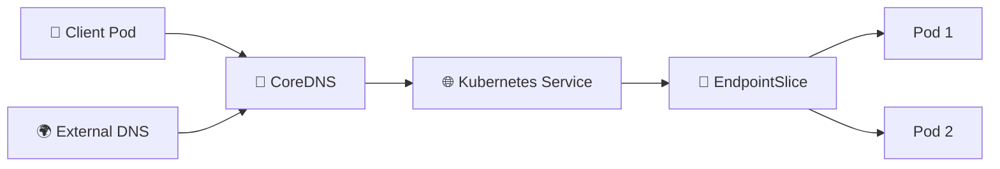

# DNS and CoreDNS 🧭

## 1. Overview

Kubernetes uses internal DNS so Pods can discover Services by name instead of relying on IP addresses.

The default DNS component in most clusters is **CoreDNS**.

For example, a Pod can access:

```text
web-service
```

instead of:

```text
10.96.20.10
```

Within the same namespace, the short Service name is usually enough. Across namespaces, Kubernetes DNS can use a fully qualified name such as:

```text
web-service.production.svc.cluster.local
```

---

## 2. DNS Resolution Flow



CoreDNS resolves Kubernetes names internally and can forward external queries to upstream DNS servers.

---

## 3. Key Concepts

| Concept             | Purpose                       |
| ------------------- | ----------------------------- |
| CoreDNS             | Kubernetes DNS server         |
| Service name        | Stable DNS name for a Service |
| Namespace           | Part of the DNS hierarchy     |
| `svc.cluster.local` | Common Service DNS suffix     |
| EndpointSlice       | Tracks backend endpoints      |
| Upstream DNS        | Resolves external domains     |

Typical Service DNS structure:

```text
<service>.<namespace>.svc.cluster.local
```

Example:

```text
postgres.database.svc.cluster.local
```

---

## 4. Cheat Sheet

View CoreDNS Pods:

```bash
kubectl get pods -n kube-system -l k8s-app=kube-dns
```

View CoreDNS Service:

```bash
kubectl get svc -n kube-system kube-dns
```

Inspect CoreDNS configuration:

```bash
kubectl get configmap coredns -n kube-system -o yaml
```

Test Service DNS:

```bash
kubectl exec -it <pod-name> -- nslookup web-service
```

Test a cross-namespace Service:

```bash
kubectl exec -it <pod-name> -- \
  nslookup web-service.production
```

View Pod DNS configuration:

```bash
kubectl exec -it <pod-name> -- cat /etc/resolv.conf
```

---

## 5. Practical Example

Suppose an API Pod needs to connect to PostgreSQL.

Instead of configuring the database IP address, the application uses:

```text
postgres-service
```

If both resources are in the same namespace, CoreDNS resolves the Service name automatically.

If PostgreSQL is in a namespace called `database`, the application can use:

```text
postgres-service.database
```

or the full name:

```text
postgres-service.database.svc.cluster.local
```

The Service IP can change internally without requiring application configuration changes.

---

## 6. YAML Example

```yaml
apiVersion: v1
kind: Service
metadata:
  name: postgres-service
  namespace: database
spec:
  selector:
    app: postgres
  ports:
    - name: postgres
      port: 5432
      targetPort: 5432
```

Applications in the cluster can resolve:

```text
postgres-service.database.svc.cluster.local
```

through CoreDNS.

---

## 7. Common Problems 🚨

* CoreDNS Pods are not healthy
* Service name is incorrect
* Wrong namespace is used
* Service has no endpoints
* Pod `/etc/resolv.conf` is misconfigured
* NetworkPolicy blocks DNS traffic
* Upstream DNS server is unreachable

---

## 8. Interview Questions 🎯

1. What does CoreDNS do in Kubernetes?
2. How does a Pod discover a Service?
3. What is the DNS format for a Kubernetes Service?
4. How do Pods access Services in another namespace?
5. What is `cluster.local`?
6. Can CoreDNS resolve external domains?
7. How would you troubleshoot Kubernetes DNS?

---

## 9. Related Topics 🔗

* Services
* ClusterIP
* Headless Service
* EndpointSlice
* ExternalName
* CNI
* NetworkPolicy
