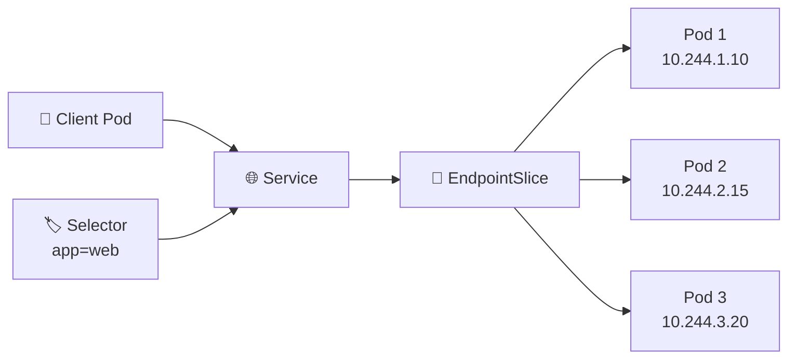

# EndpointSlice 📍

## 1. Overview

An **EndpointSlice** records the network endpoints that back a Kubernetes Service.

When a Service selects Pods using labels, Kubernetes creates EndpointSlice objects containing the IP addresses and ports of the matching Pods.

Instead of forcing networking components to track very large endpoint lists inside one object, EndpointSlices divide them into smaller groups. This improves scalability in large clusters.

EndpointSlices are used internally by components such as kube-proxy and other networking implementations.

---

## 2. Service-to-Pod Mapping



The Service provides the stable entry point, while EndpointSlices keep track of the actual backend addresses.

---

## 3. Key Concepts

| Concept          | Purpose                                           |
| ---------------- | ------------------------------------------------- |
| Endpoint         | Actual backend IP and port                        |
| EndpointSlice    | Group of Service endpoints                        |
| Service selector | Determines which Pods belong to the Service       |
| Ready condition  | Indicates whether an endpoint can receive traffic |
| Address type     | Commonly IPv4 or IPv6                             |
| Port             | Backend port associated with the endpoint         |

EndpointSlices are usually created and managed automatically by Kubernetes.

---

## 4. Cheat Sheet

List EndpointSlices:

```bash
kubectl get endpointslices
```

List slices for a specific Service:

```bash
kubectl get endpointslices \
  -l kubernetes.io/service-name=web-service
```

Inspect one:

```bash
kubectl describe endpointslice <name>
```

View YAML:

```bash
kubectl get endpointslice <name> -o yaml
```

Compare Service and Pods:

```bash
kubectl get svc web-service
kubectl get pods -l app=web -o wide
kubectl get endpointslices
```

---

## 5. Practical Example

Suppose `web-service` selects three Pods:

```text
10.244.1.10
10.244.2.15
10.244.3.20
```

Kubernetes records these addresses inside an EndpointSlice.

When one Pod is deleted and replaced with:

```text
10.244.2.25
```

Kubernetes updates the EndpointSlice automatically.

The Service itself remains unchanged, so clients continue using the same Service name and IP address.

---

## 6. YAML Example

EndpointSlices are usually generated automatically, but a simplified example looks like:

```yaml
apiVersion: discovery.k8s.io/v1
kind: EndpointSlice
metadata:
  name: web-service-example
  labels:
    kubernetes.io/service-name: web-service

addressType: IPv4

ports:
  - name: http
    protocol: TCP
    port: 8080

endpoints:
  - addresses:
      - "10.244.1.10"
    conditions:
      ready: true

  - addresses:
      - "10.244.2.15"
    conditions:
      ready: true
```

In normal Service usage, administrators generally manage the Service and Pods rather than manually creating EndpointSlices.

---

## 7. Common Problems 🚨

* Service selector matches no Pods
* EndpointSlice contains no endpoints
* Endpoints are marked not ready
* Pod labels are incorrect
* Service port does not match the application
* Networking rules are stale
* Manual EndpointSlice configuration conflicts with automated management

---

## 8. Interview Questions 🎯

1. What is an EndpointSlice?
2. How is it related to a Service?
3. What information does an EndpointSlice contain?
4. Who normally creates EndpointSlices?
5. What happens when a backend Pod IP changes?
6. Why were EndpointSlices introduced?
7. How can you check whether a Service has backend endpoints?

---

## 9. Related Topics 🔗

* Services
* ClusterIP
* kube-proxy
* Pod Readiness
* Labels and Selectors
* CoreDNS
* Service Discovery
