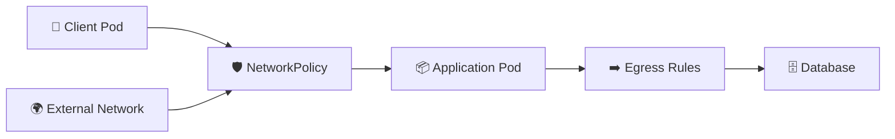

# NetworkPolicy 🛡️

## 1. Overview

A **NetworkPolicy** controls which Pods are allowed to communicate with other Pods, namespaces, or external networks.

Policies can restrict:

* **Ingress** — traffic entering a Pod
* **Egress** — traffic leaving a Pod

NetworkPolicies use **labels and selectors** to define which Pods are affected and which traffic is allowed.

They only work when the cluster uses a **CNI plugin that supports NetworkPolicy enforcement**.

---

## 2. Traffic Control



Without a matching allow rule, selected Pods may become isolated for the specified traffic direction.

---

## 3. Key Concepts

| Concept             | Purpose                               |
| ------------------- | ------------------------------------- |
| `podSelector`       | Selects Pods controlled by the policy |
| `policyTypes`       | Defines `Ingress`, `Egress`, or both  |
| `ingress`           | Defines allowed incoming traffic      |
| `egress`            | Defines allowed outgoing traffic      |
| `namespaceSelector` | Matches namespaces by labels          |
| `ipBlock`           | Allows or blocks IP ranges            |

A common security model is:

```text
Default Deny → Explicitly Allow Required Traffic
```

---

## 4. Cheat Sheet

List policies:

```bash
kubectl get networkpolicy
kubectl get netpol
```

Inspect a policy:

```bash
kubectl describe networkpolicy <policy-name>
```

View YAML:

```bash
kubectl get networkpolicy <policy-name> -o yaml
```

Check Pod labels:

```bash
kubectl get pods --show-labels
```

Check namespace labels:

```bash
kubectl get namespaces --show-labels
```

Test connectivity:

```bash
kubectl exec -it <pod-name> -- curl <destination>
```

---

## 5. Practical Example

Suppose a database Pod should only accept traffic from backend Pods.

The database is labeled:

```text
app=database
```

Backend Pods are labeled:

```text
app=backend
```

A NetworkPolicy can isolate the database and allow TCP traffic on port `5432` only from Pods with the `app=backend` label.

Other Pods are blocked from connecting.

---

## 6. YAML Example

```yaml
apiVersion: networking.k8s.io/v1
kind: NetworkPolicy
metadata:
  name: database-access
spec:
  podSelector:
    matchLabels:
      app: database

  policyTypes:
    - Ingress

  ingress:
    - from:
        - podSelector:
            matchLabels:
              app: backend

      ports:
        - protocol: TCP
          port: 5432
```

This policy applies to Pods labeled:

```yaml
app: database
```

and allows database traffic only from matching backend Pods in the same namespace.

---

## 7. Common Problems 🚨

* CNI plugin does not enforce NetworkPolicy
* Incorrect Pod labels
* Namespace selector does not match
* DNS traffic is accidentally blocked
* Egress rules block external dependencies
* Policy selects more Pods than intended
* Default-deny policy is applied without required exceptions

---

## 8. Interview Questions 🎯

1. What is a NetworkPolicy?
2. What is the difference between ingress and egress?
3. What does `podSelector` do?
4. What happens when a selected Pod has no allowed ingress rules?
5. Can NetworkPolicy work with every CNI plugin?
6. What is a default-deny policy?
7. How can namespaces be selected in a NetworkPolicy?

---

## 9. Related Topics 🔗

* CNI
* Pod Networking
* Labels and Selectors
* Namespaces
* Security
* Ingress
* Egress
