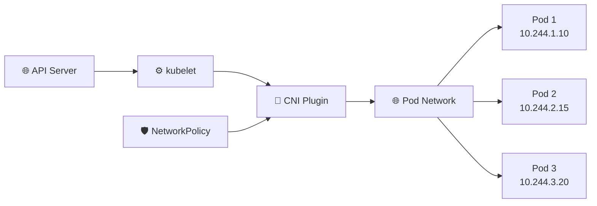

# Container Network Interface (CNI) 🔌

## 1. Overview

The **Container Network Interface (CNI)** is the plugin framework Kubernetes uses to provide Pod networking.

Kubernetes itself does not implement the full Pod network. Instead, the kubelet calls a CNI plugin when Pods are created or removed.

A CNI plugin typically handles:

* Pod IP assignment
* Network interface creation
* Routing between Pods
* Connectivity between nodes
* NetworkPolicy enforcement
* Encapsulation or direct routing, depending on the implementation

Common CNI implementations include **Calico, Cilium, Flannel, and Antrea**.

---

## 2. Networking Flow



The kubelet manages the Pod lifecycle, while the CNI plugin prepares the network required by the Pod.

---

## 3. Key Concepts

| Concept         | Purpose                                 |
| --------------- | --------------------------------------- |
| CNI plugin      | Implements Pod networking               |
| Pod CIDR        | Address range used for Pods             |
| IPAM            | Assigns Pod IP addresses                |
| Overlay network | Encapsulates traffic between nodes      |
| Routing         | Moves Pod traffic across the cluster    |
| NetworkPolicy   | May be enforced by the CNI              |
| eBPF            | Used by some modern CNI implementations |

Not every CNI provides the same capabilities.

---

## 4. Cheat Sheet

View Pod addresses:

```bash
kubectl get pods -A -o wide
```

View node Pod CIDRs:

```bash
kubectl get nodes -o wide
kubectl get nodes -o yaml
```

Check networking Pods:

```bash
kubectl get pods -n kube-system
```

Inspect a CNI Pod:

```bash
kubectl describe pod <cni-pod> -n kube-system
```

View its logs:

```bash
kubectl logs <cni-pod> -n kube-system
```

Inspect CNI configuration on a node:

```bash
ls /etc/cni/net.d/
```

Check interfaces:

```bash
ip addr
ip route
```

---

## 5. Practical Example

Suppose the scheduler assigns a new Pod to `worker-2`.

The kubelet asks the container runtime to prepare the Pod sandbox and invokes the configured CNI plugin.

The CNI plugin may then:

1. Create a network interface for the Pod.
2. Assign an IP such as `10.244.2.15`.
3. Configure routes.
4. Connect the Pod to the cluster network.
5. Apply relevant networking policy.

The Pod can then communicate with other reachable Pods without the application needing to understand the underlying network implementation.

---

## 6. YAML Example

CNI plugins are usually installed through provider-specific manifests. A simplified configuration object might look like:

```yaml
apiVersion: v1
kind: ConfigMap
metadata:
  name: cni-config
  namespace: kube-system
data:
  podCIDR: "10.244.0.0/16"
  mode: "overlay"
  networkPolicy: "enabled"
```

Actual installation manifests differ significantly between Calico, Cilium, Flannel, Antrea, and other implementations.

---

## 7. Common Problems 🚨

* CNI Pods are not running
* Pod remains in `ContainerCreating`
* Pod IP is not assigned
* Cross-node Pod traffic fails
* Incorrect Pod CIDR
* NetworkPolicy is not enforced
* Routing or encapsulation fails
* CNI configuration differs between nodes

---

## 8. Interview Questions 🎯

1. What is CNI?
2. Why does Kubernetes need a CNI plugin?
3. Which component invokes the CNI plugin?
4. What is IPAM?
5. What is an overlay network?
6. Do all CNI plugins support NetworkPolicy?
7. How would a CNI failure affect Pods?

---

## 9. Related Topics 🔗

* Pod Networking
* NetworkPolicy
* kubelet
* kube-proxy
* Calico
* Cilium
* Flannel
* eBPF
