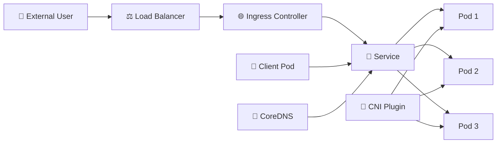

# Networking and Services 🌐

## Overview

Kubernetes networking connects Pods, Services, nodes, and external users.

Each Pod receives its own cluster IP address, but Pod IPs are temporary and may change when workloads are recreated. **Services** provide stable virtual addresses and DNS names so applications can communicate reliably without depending on individual Pod IPs.

Kubernetes networking also includes mechanisms for exposing applications outside the cluster, controlling traffic between workloads, resolving service names, and integrating network plugins through the Container Network Interface (CNI).

This folder covers the main networking concepts needed to understand how traffic moves through a Kubernetes cluster.

---

## Traffic Flow



---

## Folder Structure

```text id="4ae6tt"
04-Networking-and-Services/
├── README.md
├── Pod-Networking-and-Services.md
├── ClusterIP.md
├── NodePort.md
├── LoadBalancer.md
├── Headless-Service.md
├── ExternalName.md
├── Ingress.md
├── Ingress-Controller.md
├── DNS-and-CoreDNS.md
├── EndpointSlice.md
├── NetworkPolicy.md
└── CNI.md
```

---

## Main Topics

### `Pod-Networking-and-Services.md`

Introduces the Kubernetes networking model, Pod IP addresses, Service discovery, selectors, ports, and the relationship between Services and backend Pods.

### `ClusterIP.md`

Covers the default Service type used for internal communication inside the cluster.

### `NodePort.md`

Explains how a Service can be exposed through a port on each Kubernetes node.

### `LoadBalancer.md`

Covers external load balancer integration and how cloud or infrastructure providers expose Services.

### `Headless-Service.md`

Explains Services without a virtual ClusterIP, commonly used with StatefulSets and direct Pod discovery.

### `ExternalName.md`

Maps a Kubernetes Service name to an external DNS name without creating a proxy or ClusterIP.

### `Ingress.md` and `Ingress-Controller.md`

Explain HTTP/HTTPS routing into the cluster and the controller that implements Ingress rules.

### `DNS-and-CoreDNS.md`

Covers internal DNS resolution and Kubernetes Service discovery.

### `EndpointSlice.md`

Explains how Kubernetes tracks the actual backend endpoints associated with Services.

### `NetworkPolicy.md`

Controls which Pods are allowed to communicate with each other and with external networks.

### `CNI.md`

Introduces the plugin architecture responsible for implementing Pod networking.

---

## Useful Commands

```bash id="ljn95a"
kubectl get pods -o wide
kubectl get svc
kubectl get endpointslices
kubectl get ingress
kubectl get networkpolicy
kubectl describe svc <service-name>
kubectl get pods -n kube-system
```

---

## Goal

The goal of this folder is to explain how Kubernetes moves traffic from one workload to another and from external users into the cluster. After completing it, the reader should understand Pod networking, Service types, DNS, Ingress, endpoint discovery, network policy, and the role of CNI plugins.
