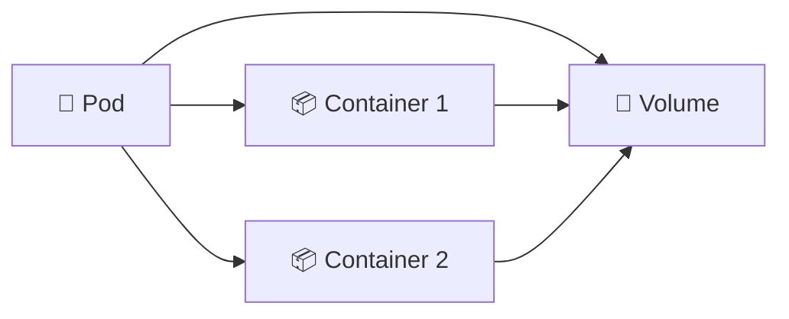

# Volumes 💾

## 1. Overview

A **Volume** provides storage that can be mounted into one or more containers inside a Pod.

Containers have ephemeral filesystems, so data stored only inside the container may disappear when the container is replaced. Volumes provide a separate storage location that can survive container restarts and can also be shared between containers in the same Pod.

Common volume types include:

* `emptyDir`
* `configMap`
* `secret`
* `persistentVolumeClaim`
* `hostPath`

Not all volumes are persistent. Some exist only for the lifetime of the Pod.

---

## 2. Volume Relationship



Multiple containers can mount the same volume and exchange data through it.

---

## 3. Key Concepts

| Concept                 | Purpose                                |
| ----------------------- | -------------------------------------- |
| `volumes`               | Defines storage available to the Pod   |
| `volumeMounts`          | Mounts the volume inside a container   |
| `mountPath`             | Filesystem path inside the container   |
| `emptyDir`              | Temporary storage for the Pod lifetime |
| `persistentVolumeClaim` | Connects the Pod to persistent storage |
| `configMap` / `secret`  | Mounts configuration or sensitive data |

A volume is defined at the **Pod level** and mounted individually into containers.

---

## 4. Cheat Sheet

Inspect Pod volumes:

```bash
kubectl describe pod <pod-name>
```

View Pod YAML:

```bash
kubectl get pod <pod-name> -o yaml
```

Check mounted files:

```bash
kubectl exec -it <pod-name> -- mount
```

View files inside a mount:

```bash
kubectl exec -it <pod-name> -- ls -lah <mount-path>
```

Check PVC-backed volumes:

```bash
kubectl get pvc
```

---

## 5. Practical Example

Suppose an application container writes files to:

```text
/data
```

A second helper container needs to process those files.

Both containers can mount the same `emptyDir` volume. The application writes data into the shared directory, and the helper reads from it.

The files survive individual container restarts but disappear when the Pod itself is permanently removed.

---

## 6. YAML Example

```yaml
apiVersion: v1
kind: Pod
metadata:
  name: shared-volume-demo
spec:
  volumes:
    - name: shared-data
      emptyDir: {}

  containers:
    - name: writer
      image: busybox:1.36
      command:
        - sh
        - -c
        - while true; do date >> /data/log.txt; sleep 10; done
      volumeMounts:
        - name: shared-data
          mountPath: /data

    - name: reader
      image: busybox:1.36
      command:
        - sh
        - -c
        - tail -f /data/log.txt
      volumeMounts:
        - name: shared-data
          mountPath: /data
```

Both containers share the same `emptyDir` volume.

---

## 7. Common Problems 🚨

* Volume name does not match `volumeMounts`
* Incorrect `mountPath`
* File permissions block access
* Data disappears after Pod deletion
* PVC is not bound
* `hostPath` ties the Pod to a specific node
* Multiple containers overwrite shared files

---

## 8. Interview Questions 🎯

1. What is a Kubernetes Volume?
2. Why are volumes needed if containers have filesystems?
3. What is the difference between `volumes` and `volumeMounts`?
4. Does `emptyDir` survive Pod deletion?
5. Can multiple containers share one volume?
6. What is a PVC-backed volume?
7. Why should `hostPath` be used carefully?

---

## 9. Related Topics 🔗

* PersistentVolume
* PersistentVolumeClaim
* `emptyDir`
* ConfigMap
* Secret
* StatefulSet
* CSI
