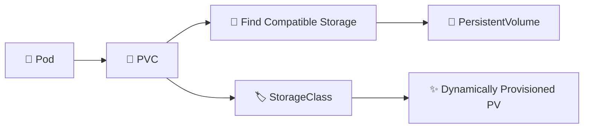

# PersistentVolumeClaim 📄

## 1. Overview

A **PersistentVolumeClaim (PVC)** is a request for persistent storage.

A workload asks for storage by defining requirements such as:

* Storage size
* Access mode
* StorageClass
* Volume mode

Kubernetes then binds the claim to a compatible **PersistentVolume (PV)** or dynamically provisions new storage through a StorageClass.

Pods usually consume persistent storage through a PVC rather than referencing a PV directly.

---

## 2. Storage Flow



---

## 3. Key Concepts

| Concept                      | Purpose                       |
| ---------------------------- | ----------------------------- |
| `resources.requests.storage` | Requested storage size        |
| `accessModes`                | Required access behavior      |
| `storageClassName`           | Selects a StorageClass        |
| `volumeMode`                 | Filesystem or block           |
| `status.phase`               | Commonly `Pending` or `Bound` |
| Binding                      | Connects the PVC to a PV      |

PVCs are **namespaced resources**, while PVs are cluster-scoped.

---

## 4. Cheat Sheet

List PVCs:

```bash
kubectl get pvc
```

Across all namespaces:

```bash
kubectl get pvc -A
```

Inspect a claim:

```bash
kubectl describe pvc <pvc-name>
```

View YAML:

```bash
kubectl get pvc <pvc-name> -o yaml
```

Check associated PV:

```bash
kubectl get pv
```

Watch binding:

```bash
kubectl get pvc -w
```

---

## 5. Practical Example

Suppose PostgreSQL requires `10Gi` of persistent storage.

The application creates a PVC requesting:

```text
10Gi
ReadWriteOnce
StorageClass: fast
```

If a compatible PV already exists, Kubernetes can bind the claim to it.

If the `fast` StorageClass supports dynamic provisioning, Kubernetes can instead create a new PV automatically.

The Pod then mounts the PVC at a path such as:

```text
/var/lib/postgresql/data
```

---

## 6. YAML Example

```yaml
apiVersion: v1
kind: PersistentVolumeClaim
metadata:
  name: postgres-data
  namespace: database
spec:
  accessModes:
    - ReadWriteOnce

  storageClassName: fast

  resources:
    requests:
      storage: 10Gi
---
apiVersion: v1
kind: Pod
metadata:
  name: postgres
  namespace: database
spec:
  containers:
    - name: postgres
      image: postgres:17
      env:
        - name: POSTGRES_PASSWORD
          value: example-password
      volumeMounts:
        - name: database-storage
          mountPath: /var/lib/postgresql/data

  volumes:
    - name: database-storage
      persistentVolumeClaim:
        claimName: postgres-data
```

The Pod mounts whatever persistent storage Kubernetes binds to `postgres-data`.

---

## 7. Common Problems 🚨

* PVC remains `Pending`
* Requested StorageClass does not exist
* No compatible PV is available
* Requested storage exceeds available capacity
* Access modes do not match
* Dynamic provisioner is unavailable
* Pod references the wrong PVC name

---

## 8. Interview Questions 🎯

1. What is a PersistentVolumeClaim?
2. What is the difference between a PV and PVC?
3. Are PVCs namespaced?
4. What causes a PVC to remain `Pending`?
5. What does `storageClassName` do?
6. Can Kubernetes create a PV automatically for a PVC?
7. How does a Pod use a PVC?

---

## 9. Related Topics 🔗

* PersistentVolume
* StorageClass
* Dynamic Provisioning
* Access Modes
* StatefulSet
* CSI
* Reclaim Policies
