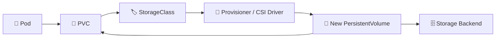

# StorageClass 🏷️

## 1. Overview

A **StorageClass** defines how Kubernetes should provision persistent storage.

Instead of manually creating PersistentVolumes, administrators can define storage profiles such as:

* Fast SSD
* Standard disk
* NFS-backed storage
* Ceph RBD
* Cloud block storage

A PVC can request a StorageClass by name, and Kubernetes uses the associated provisioner to create suitable storage automatically.

---

## 2. Dynamic Provisioning Flow



---

## 3. Key Concepts

| Concept                | Purpose                                   |
| ---------------------- | ----------------------------------------- |
| `provisioner`          | Storage driver that creates volumes       |
| `parameters`           | Backend-specific storage settings         |
| `reclaimPolicy`        | Controls volume handling after release    |
| `volumeBindingMode`    | Controls when provisioning/binding occurs |
| `allowVolumeExpansion` | Allows PVC size expansion                 |
| Default StorageClass   | Used when PVC specifies no class          |

Common binding modes include:

```text
Immediate
WaitForFirstConsumer
```

`WaitForFirstConsumer` delays provisioning until Kubernetes knows where the Pod will be scheduled.

---

## 4. Cheat Sheet

List StorageClasses:

```bash
kubectl get storageclass
kubectl get sc
```

Inspect one:

```bash
kubectl describe sc <storage-class-name>
```

View YAML:

```bash
kubectl get sc <storage-class-name> -o yaml
```

Identify the default StorageClass:

```bash
kubectl get sc
```

Look for:

```text
(default)
```

Check PVC StorageClass usage:

```bash
kubectl get pvc
```

---

## 5. Practical Example

Suppose a cluster offers two storage tiers:

```text
standard → HDD-backed storage
fast     → SSD-backed storage
```

A database can request:

```yaml
storageClassName: fast
```

while a lower-priority workload can use:

```yaml
storageClassName: standard
```

The application does not need to know which physical disk or storage array provides the capacity.

---

## 6. YAML Example

```yaml
apiVersion: storage.k8s.io/v1
kind: StorageClass
metadata:
  name: fast
provisioner: example.csi.storage.io
reclaimPolicy: Delete
allowVolumeExpansion: true
volumeBindingMode: WaitForFirstConsumer

parameters:
  type: ssd
---
apiVersion: v1
kind: PersistentVolumeClaim
metadata:
  name: database-storage
spec:
  accessModes:
    - ReadWriteOnce

  storageClassName: fast

  resources:
    requests:
      storage: 20Gi
```

The PVC requests storage from the `fast` StorageClass, and the provisioner creates a matching PersistentVolume.

---

## 7. Common Problems 🚨

* StorageClass does not exist
* Provisioner or CSI driver is unavailable
* PVC remains `Pending`
* Incorrect backend parameters
* Default StorageClass is missing
* Volume expansion is disabled
* Binding mode conflicts with scheduling requirements

---

## 8. Interview Questions 🎯

1. What is a StorageClass?
2. What does the `provisioner` field do?
3. How does a PVC request a StorageClass?
4. What is a default StorageClass?
5. What is the difference between `Immediate` and `WaitForFirstConsumer`?
6. What does `allowVolumeExpansion` do?
7. How does StorageClass enable dynamic provisioning?

---

## 9. Related Topics 🔗

* PersistentVolume
* PersistentVolumeClaim
* Dynamic Provisioning
* CSI
* Access Modes
* Reclaim Policies
