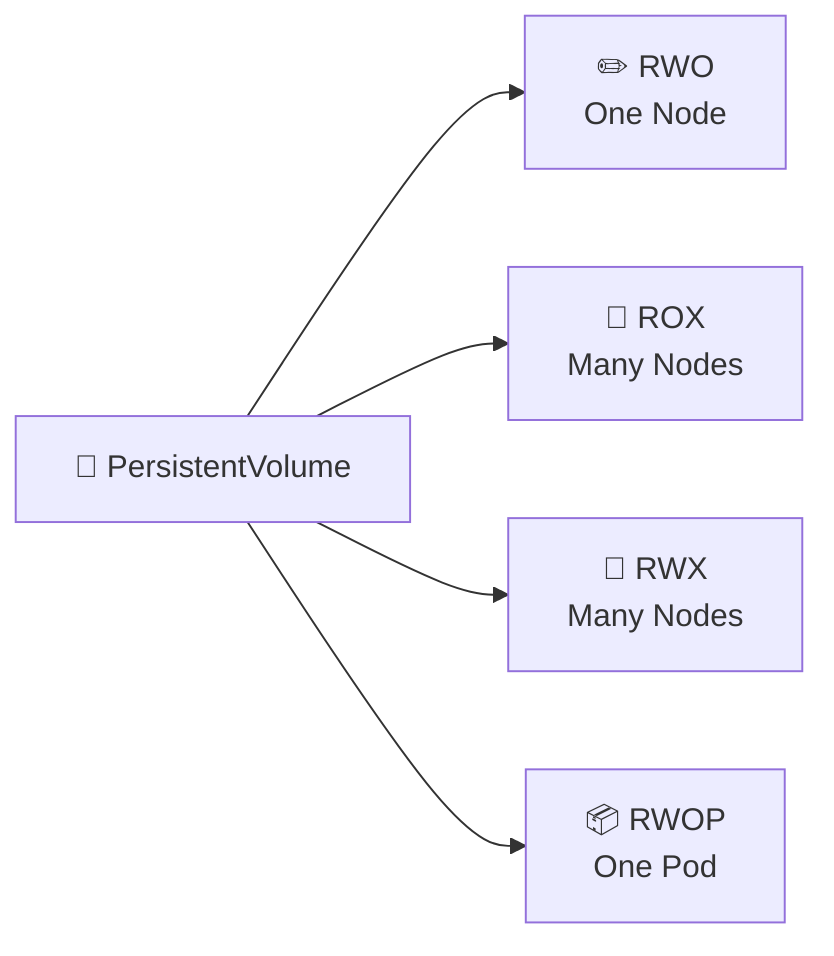

# Access Modes 🔐

## 1. Overview

**Access Modes** define how a PersistentVolume can be mounted by workloads.

The main modes are:

* `ReadWriteOnce` (`RWO`) — read/write by a single node
* `ReadOnlyMany` (`ROX`) — read-only by many nodes
* `ReadWriteMany` (`RWX`) — read/write by many nodes
* `ReadWriteOncePod` (`RWOP`) — read/write by a single Pod

The exact modes available depend on the storage backend and CSI driver.

---

## 2. Access Mode Comparison



---

## 3. Key Concepts

| Mode   | Meaning                    | Typical Use                 |
| ------ | -------------------------- | --------------------------- |
| `RWO`  | Read/write from one node   | Databases, block storage    |
| `ROX`  | Read-only from many nodes  | Shared static content       |
| `RWX`  | Read/write from many nodes | Shared filesystems          |
| `RWOP` | Read/write by one Pod      | Strong single-Pod ownership |

An access mode describes **mount capability**, not application-level locking or data consistency.

---

## 4. Cheat Sheet

View PV access modes:

```bash
kubectl get pv
```

View PVC access modes:

```bash
kubectl get pvc
```

Inspect a PV:

```bash
kubectl describe pv <pv-name>
```

Inspect a PVC:

```bash
kubectl describe pvc <pvc-name>
```

Check storage driver support:

```bash
kubectl get sc
kubectl describe sc <storage-class-name>
```

---

## 5. Practical Example

Suppose PostgreSQL runs on one node and uses block storage.

A typical PVC might request:

```text
ReadWriteOnce
```

If several Pods on different nodes need shared file access, a backend supporting:

```text
ReadWriteMany
```

would be more appropriate.

The important point is that the **storage backend must actually support the requested access mode**.

---

## 6. YAML Example

```yaml
apiVersion: v1
kind: PersistentVolumeClaim
metadata:
  name: shared-data
spec:
  storageClassName: shared-storage

  accessModes:
    - ReadWriteMany

  resources:
    requests:
      storage: 20Gi
```

A Pod can then mount the claim:

```yaml
apiVersion: v1
kind: Pod
metadata:
  name: shared-app
spec:
  containers:
    - name: app
      image: nginx:1.27
      volumeMounts:
        - name: shared-storage
          mountPath: /data

  volumes:
    - name: shared-storage
      persistentVolumeClaim:
        claimName: shared-data
```

This works only if the underlying storage supports `ReadWriteMany`.

---

## 7. Common Problems 🚨

* Requested access mode is unsupported
* PVC remains `Pending`
* `RWO` is misunderstood as “one Pod only”
* Multiple Pods write concurrently without application-level coordination
* Storage backend supports fewer modes than expected
* CSI driver documentation is not checked

---

## 8. Interview Questions 🎯

1. What are Kubernetes access modes?
2. What does `ReadWriteOnce` mean?
3. What is the difference between `RWO` and `RWOP`?
4. When would you use `RWX`?
5. Does Kubernetes guarantee data consistency with `RWX`?
6. Why might a PVC remain `Pending` because of access modes?
7. Who determines which access modes are supported?

---

## 9. Related Topics 🔗

* PersistentVolume
* PersistentVolumeClaim
* StorageClass
* CSI
* StatefulSet
* Shared Storage
