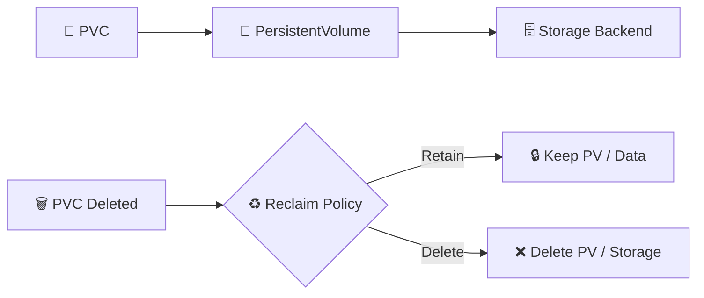

# Reclaim Policies ♻️

## 1. Overview

A **Reclaim Policy** defines what happens to a PersistentVolume after its bound PersistentVolumeClaim is deleted.

The two main policies are:

* `Retain` — keeps the underlying storage and data
* `Delete` — removes the PersistentVolume and usually deletes the underlying storage

Reclaim policy is important because it determines whether application data survives after a claim is removed.

---

## 2. Reclaim Flow



---

## 3. Key Concepts

| Policy   | Result                                                        |
| -------- | ------------------------------------------------------------- |
| `Retain` | Data remains and requires manual cleanup or reuse             |
| `Delete` | PV and underlying dynamically provisioned storage are removed |

`Retain` is commonly preferred when data is valuable or must be recovered manually.

`Delete` is convenient for temporary or automatically managed workloads.

---

## 4. Cheat Sheet

View reclaim policies:

```bash
kubectl get pv
```

Inspect a PV:

```bash
kubectl describe pv <pv-name>
```

View StorageClass reclaim policy:

```bash
kubectl get sc
kubectl describe sc <storage-class-name>
```

Change a PV reclaim policy:

```bash
kubectl patch pv <pv-name> \
  -p '{"spec":{"persistentVolumeReclaimPolicy":"Retain"}}'
```

Check PVC status:

```bash
kubectl get pvc
```

---

## 5. Practical Example

Suppose a PostgreSQL database uses a dynamically provisioned volume.

If the StorageClass uses:

```text
reclaimPolicy: Delete
```

deleting the PVC may also delete the underlying storage.

For important database data, an administrator may prefer:

```text
reclaimPolicy: Retain
```

The PV becomes released after the claim is deleted, but the underlying data remains available for recovery or manual reuse.

---

## 6. YAML Example

```yaml
apiVersion: storage.k8s.io/v1
kind: StorageClass
metadata:
  name: database-storage
provisioner: example.csi.storage.io
reclaimPolicy: Retain
volumeBindingMode: WaitForFirstConsumer
allowVolumeExpansion: true
---
apiVersion: v1
kind: PersistentVolumeClaim
metadata:
  name: postgres-data
spec:
  storageClassName: database-storage

  accessModes:
    - ReadWriteOnce

  resources:
    requests:
      storage: 20Gi
```

Volumes dynamically created through this StorageClass inherit the `Retain` reclaim policy.

---

## 7. Common Problems 🚨

* Important data is accidentally deleted
* PV remains in `Released`
* Retained volume is not manually cleaned up
* Old `claimRef` prevents reuse
* StorageClass uses unexpected reclaim policy
* Cloud disks continue generating cost after PVC deletion

---

## 8. Interview Questions 🎯

1. What is a reclaim policy?
2. What is the difference between `Retain` and `Delete`?
3. What happens to data with `Retain`?
4. What happens to a dynamically provisioned volume with `Delete`?
5. Where can reclaim policy be configured?
6. Why might a PV remain in `Released`?
7. Which policy would you prefer for critical database storage?

---

## 9. Related Topics 🔗

* PersistentVolume
* PersistentVolumeClaim
* StorageClass
* Dynamic Provisioning
* CSI
* Backup and Recovery
