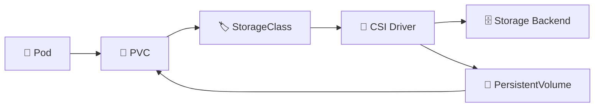

# Container Storage Interface (CSI) 🔌

## 1. Overview

The **Container Storage Interface (CSI)** is the standard Kubernetes uses to integrate with external storage systems.

Instead of building storage-specific code directly into Kubernetes, storage vendors provide CSI drivers.

Common CSI-backed storage systems include:

* Ceph
* VMware vSphere
* AWS EBS
* Azure Disk
* Google Persistent Disk
* NetApp
* Longhorn

CSI allows Kubernetes to provision, attach, mount, expand, and snapshot storage through a common interface.

---

## 2. CSI Storage Flow



The application uses Kubernetes objects, while the CSI driver handles communication with the actual storage platform.

---

## 3. Key Concepts

| Concept          | Purpose                                        |
| ---------------- | ---------------------------------------------- |
| CSI Driver       | Connects Kubernetes to storage                 |
| CSI Controller   | Handles provisioning and attachment operations |
| CSI Node Plugin  | Handles mounting on worker nodes               |
| StorageClass     | Specifies which CSI provisioner to use         |
| VolumeAttachment | Tracks storage attached to nodes               |
| Snapshot support | Enables CSI-based volume snapshots             |

CSI drivers commonly run as Pods inside the cluster.

---

## 4. Cheat Sheet

Find CSI components:

```bash
kubectl get pods -A | grep csi
```

List CSI drivers:

```bash
kubectl get csidrivers
```

Inspect a driver:

```bash
kubectl describe csidriver <driver-name>
```

View StorageClasses:

```bash
kubectl get sc
```

Check volume attachments:

```bash
kubectl get volumeattachments
```

Inspect PVC provisioning:

```bash
kubectl describe pvc <pvc-name>
```

View CSI logs:

```bash
kubectl logs <csi-pod> -n <namespace>
```

---

## 5. Practical Example

Suppose a PVC requests `20Gi` from a Ceph-backed StorageClass.

The Kubernetes control plane passes the request to the Ceph CSI driver.

The driver then:

1. Creates storage on Ceph.
2. Creates or associates a PersistentVolume.
3. Attaches the volume to the correct node.
4. Mounts the filesystem for the Pod.
5. Reports the storage state back to Kubernetes.

The application itself only needs to reference the PVC.

---

## 6. YAML Example

```yaml
apiVersion: storage.k8s.io/v1
kind: StorageClass
metadata:
  name: ceph-block
provisioner: rbd.csi.ceph.com
reclaimPolicy: Retain
allowVolumeExpansion: true
volumeBindingMode: Immediate
---
apiVersion: v1
kind: PersistentVolumeClaim
metadata:
  name: database-data
spec:
  storageClassName: ceph-block

  accessModes:
    - ReadWriteOnce

  resources:
    requests:
      storage: 20Gi
```

The CSI driver referenced by the StorageClass handles the underlying volume creation.

---

## 7. Common Problems 🚨

* CSI controller Pods are unhealthy
* CSI node plugin is missing from a worker node
* PVC remains `Pending`
* Volume attachment fails
* Mount operation times out
* Storage backend is unreachable
* CSI credentials are incorrect
* Volume expansion or snapshots are unsupported

---

## 8. Interview Questions 🎯

1. What is CSI?
2. Why was CSI introduced?
3. What does a CSI driver do?
4. What is the difference between CSI controller and node components?
5. How does a StorageClass reference a CSI driver?
6. What is a VolumeAttachment?
7. Can CSI support volume expansion and snapshots?

---

## 9. Related Topics 🔗

* StorageClass
* PersistentVolume
* PersistentVolumeClaim
* Dynamic Provisioning
* VolumeAttachment
* Volume Snapshots
* Ceph
