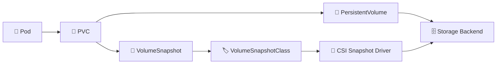

# Volume Snapshots 📸

## 1. Overview

A **VolumeSnapshot** captures the state of a persistent volume at a specific point in time.

Snapshots are commonly used for:

* Backup workflows
* Fast recovery
* Cloning data
* Testing upgrades
* Protecting stateful workloads before changes

Snapshots depend on a **CSI driver that supports snapshot functionality**.

A VolumeSnapshot does not usually copy data into a Kubernetes object. Instead, it references a snapshot created on the underlying storage backend.

---

## 2. Snapshot Flow



---

## 3. Key Concepts

| Concept                 | Purpose                                 |
| ----------------------- | --------------------------------------- |
| `VolumeSnapshot`        | Requests a snapshot                     |
| `VolumeSnapshotClass`   | Defines snapshot behavior               |
| `VolumeSnapshotContent` | Represents the actual snapshot resource |
| CSI driver              | Creates the snapshot on the backend     |
| Restore                 | Creates a new PVC from a snapshot       |

Snapshots are typically namespace-scoped through the `VolumeSnapshot` object.

---

## 4. Cheat Sheet

List snapshots:

```bash
kubectl get volumesnapshot
```

Inspect a snapshot:

```bash
kubectl describe volumesnapshot <snapshot-name>
```

List snapshot classes:

```bash
kubectl get volumesnapshotclass
```

List snapshot contents:

```bash
kubectl get volumesnapshotcontent
```

View snapshot YAML:

```bash
kubectl get volumesnapshot <snapshot-name> -o yaml
```

---

## 5. Practical Example

Suppose a PostgreSQL workload uses a PVC called:

```text
postgres-data
```

Before performing a database upgrade, an administrator creates a VolumeSnapshot.

If the upgrade fails, a new PVC can be created from that snapshot and used to restore the previous data state.

For application-consistent backups, the application may need to flush or quiesce writes before the snapshot is taken.

---

## 6. YAML Example

Create a snapshot:

```yaml
apiVersion: snapshot.storage.k8s.io/v1
kind: VolumeSnapshot
metadata:
  name: postgres-snapshot
spec:
  volumeSnapshotClassName: csi-snapshot-class
  source:
    persistentVolumeClaimName: postgres-data
```

Restore it into a new PVC:

```yaml
apiVersion: v1
kind: PersistentVolumeClaim
metadata:
  name: postgres-restored
spec:
  storageClassName: fast
  dataSource:
    name: postgres-snapshot
    kind: VolumeSnapshot
    apiGroup: snapshot.storage.k8s.io
  accessModes:
    - ReadWriteOnce
  resources:
    requests:
      storage: 20Gi
```

---

## 7. Common Problems 🚨

* CSI driver does not support snapshots
* VolumeSnapshotClass is missing
* Snapshot remains unready
* Snapshot controller is unavailable
* Storage backend cannot create the snapshot
* Restored PVC uses an incompatible StorageClass
* Snapshot is crash-consistent but not application-consistent

---

## 8. Interview Questions 🎯

1. What is a VolumeSnapshot?
2. What is the role of a VolumeSnapshotClass?
3. What does VolumeSnapshotContent represent?
4. Can every CSI driver create snapshots?
5. How do you restore a PVC from a snapshot?
6. What is the difference between crash-consistent and application-consistent snapshots?
7. Are snapshots a complete backup strategy by themselves?

---

## 9. Related Topics 🔗

* CSI
* PersistentVolumeClaim
* PersistentVolume
* StorageClass
* Backup and Recovery
* StatefulSet
* Disaster Recovery
