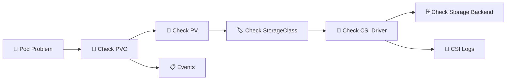

# Storage Troubleshooting 🧰

## 1. Overview

Kubernetes storage problems usually appear when a PVC cannot bind, a volume cannot attach, or a filesystem cannot mount inside a Pod.

The troubleshooting path should usually follow:

```text
Pod → PVC → PV → StorageClass → CSI Driver → Storage Backend
```

Start with the Pod and claim, then move deeper only when necessary.

---

## 2. Troubleshooting Flow



---

## 3. Common Failure Points

| Symptom                 | Likely Cause                           |
| ----------------------- | -------------------------------------- |
| PVC `Pending`           | No matching PV or provisioning failure |
| `FailedMount`           | Mount, permission, or CSI problem      |
| `FailedAttachVolume`    | Volume cannot attach to node           |
| Pod `ContainerCreating` | Storage or networking setup incomplete |
| PV `Released`           | Previous PVC deleted                   |
| Volume read-only        | Backend or filesystem issue            |
| Multi-attach error      | Access mode or attachment conflict     |

---

## 4. Cheat Sheet

Check PVC status:

```bash
kubectl get pvc
kubectl describe pvc <pvc-name>
```

Check PVs:

```bash
kubectl get pv
kubectl describe pv <pv-name>
```

Check StorageClasses:

```bash
kubectl get sc
kubectl describe sc <storage-class>
```

Inspect Pod events:

```bash
kubectl describe pod <pod-name>
```

View recent events:

```bash
kubectl get events --sort-by=.metadata.creationTimestamp
```

Check CSI components:

```bash
kubectl get pods -A | grep csi
kubectl get csidrivers
kubectl get volumeattachments
```

View CSI logs:

```bash
kubectl logs <csi-pod> -n <namespace>
```

---

## 5. Practical Example

Suppose a PostgreSQL Pod remains in:

```text
ContainerCreating
```

and `kubectl describe pod` reports:

```text
FailedMount
```

A practical investigation would be:

```bash
kubectl describe pod postgres
kubectl get pvc
kubectl describe pvc postgres-data
kubectl get pv
kubectl get sc
```

If the PVC is already `Bound`, the problem is likely further down the chain: CSI attachment, node mounting, filesystem permissions, or the underlying storage backend.

---

## 6. YAML Example

A typical PVC and Pod configuration:

```yaml
apiVersion: v1
kind: PersistentVolumeClaim
metadata:
  name: app-data
spec:
  storageClassName: fast
  accessModes:
    - ReadWriteOnce
  resources:
    requests:
      storage: 10Gi
---
apiVersion: v1
kind: Pod
metadata:
  name: storage-test
spec:
  containers:
    - name: app
      image: nginx:1.27
      volumeMounts:
        - name: data
          mountPath: /data

  volumes:
    - name: data
      persistentVolumeClaim:
        claimName: app-data
```

Verify that `app-data` becomes `Bound` before expecting the Pod to mount it successfully.

---

## 7. Common Problems 🚨

* Wrong `storageClassName`
* Unsupported access mode
* CSI driver unhealthy
* Storage backend unreachable
* Volume already attached elsewhere
* PVC requests too much capacity
* Node cannot mount the filesystem
* Permissions prevent application access

---

## 8. Interview Questions 🎯

1. How do you troubleshoot a PVC stuck in `Pending`?
2. What causes `FailedMount`?
3. What is a multi-attach error?
4. How do you check CSI driver health?
5. What does a `Bound` PVC tell you?
6. Where do you look for storage-related Pod events?
7. What troubleshooting order would you follow?

---

## 9. Related Topics 🔗

* PersistentVolume
* PersistentVolumeClaim
* StorageClass
* CSI
* Access Modes
* VolumeAttachment
* Events
* StatefulSet
