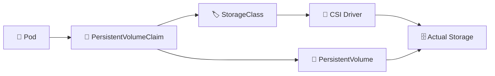

# Kubernetes Storage 💾

## Overview

Kubernetes Pods are temporary, but many applications need data to survive Pod restarts, rescheduling, and node failures.

Kubernetes storage separates application workloads from the underlying storage infrastructure through objects such as **Volumes**, **PersistentVolumes (PV)**, **PersistentVolumeClaims (PVC)**, **StorageClasses**, and **CSI drivers**.

This folder explains how Kubernetes requests, provisions, attaches, mounts, retains, and snapshots storage for workloads.

---

## Storage Flow



A Pod normally requests storage through a PVC rather than communicating directly with the storage system.

---

## Folder Structure

```text
05-Storage/
├── README.md
├── Volumes.md
├── PersistentVolume.md
├── PersistentVolumeClaim.md
├── StorageClass.md
├── Dynamic-Provisioning.md
├── Access-Modes.md
├── Reclaim-Policies.md
├── CSI.md
├── Volume-Snapshots.md
└── Storage-Troubleshooting.md
```

---

## Main Topics

### `Volumes.md`

Introduces Pod-attached storage and common volume types such as `emptyDir`, `configMap`, `secret`, and persistent storage mounts.

### `PersistentVolume.md`

Explains cluster-level storage resources that represent available persistent capacity.

### `PersistentVolumeClaim.md`

Covers how workloads request storage using size, access mode, and StorageClass requirements.

### `StorageClass.md`

Defines storage profiles and provisioning behavior, including parameters such as storage backend, reclaim policy, and volume binding mode.

### `Dynamic-Provisioning.md`

Explains how Kubernetes automatically creates PersistentVolumes when a matching PVC is requested.

### `Access-Modes.md`

Covers:

* `ReadWriteOnce`
* `ReadOnlyMany`
* `ReadWriteMany`
* `ReadWriteOncePod`

### `Reclaim-Policies.md`

Explains what happens to storage after a PVC is deleted, primarily through `Retain` and `Delete`.

### `CSI.md`

Introduces the **Container Storage Interface**, which allows Kubernetes to integrate with storage systems such as Ceph, VMware, cloud disks, SAN, and other storage platforms.

### `Volume-Snapshots.md`

Covers storage snapshots used for backup, recovery, cloning, and data protection.

### `Storage-Troubleshooting.md`

Focuses on issues such as:

* PVC stuck in `Pending`
* Volume mount failures
* CSI driver errors
* Access-mode conflicts
* Node attachment problems
* Storage capacity shortages

---

## Useful Commands

```bash
kubectl get pv
kubectl get pvc
kubectl get storageclass
kubectl get sc
kubectl describe pvc <pvc-name>
kubectl describe pv <pv-name>
kubectl get volumesnapshot
kubectl get pods -n kube-system
```

Inspect storage associated with a Pod:

```bash
kubectl describe pod <pod-name>
```

---

## Goal

The goal of this folder is to explain how Kubernetes separates application storage requirements from the physical storage infrastructure underneath the cluster.

After completing it, the reader should understand the relationship between **Pods, PVCs, PVs, StorageClasses, CSI drivers, access modes, reclaim policies, and snapshots**, as well as the basic troubleshooting workflow when storage fails.
