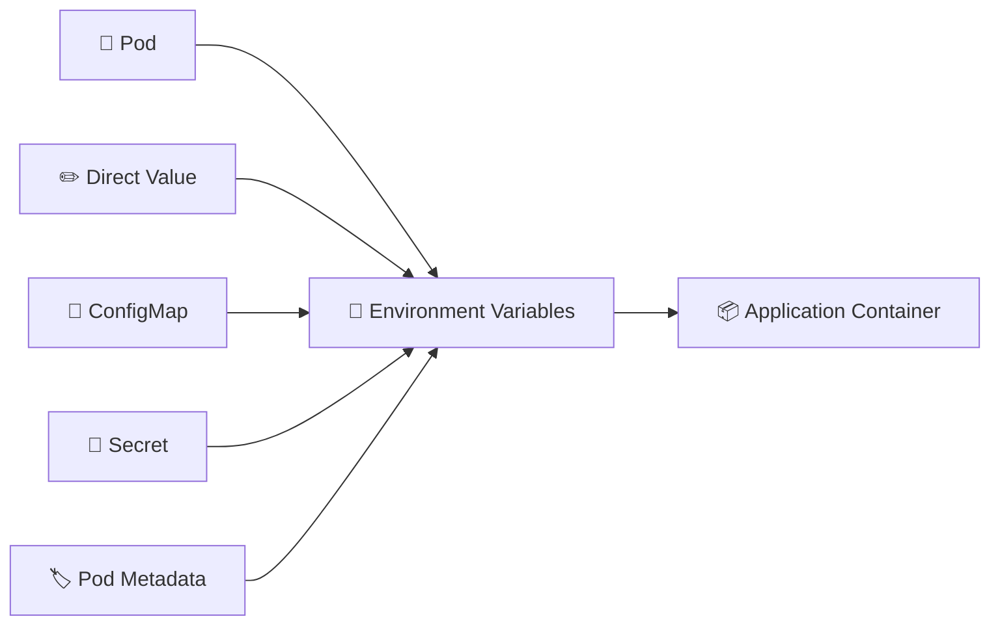

# Environment Variables 🌱

## 1. Overview

Kubernetes can pass configuration into containers through **environment variables**.

These values may be defined directly in the Pod specification or loaded from other Kubernetes resources such as:

* ConfigMaps
* Secrets
* Pod metadata through the Downward API

Environment variables are useful for application settings such as ports, feature flags, database hosts, runtime modes, and credentials.

---

## 2. Configuration Flow



---

## 3. Key Concepts

| Field             | Purpose                                  |
| ----------------- | ---------------------------------------- |
| `env`             | Defines individual environment variables |
| `value`           | Sets a literal value                     |
| `valueFrom`       | Loads a value from another source        |
| `envFrom`         | Imports multiple variables at once       |
| `configMapKeyRef` | Reads a ConfigMap key                    |
| `secretKeyRef`    | Reads a Secret key                       |

Environment variables are normally available to the application when the container starts.

---

## 4. Cheat Sheet

View environment variables inside a Pod:

```bash
kubectl exec <pod-name> -- env
```

Check one variable:

```bash
kubectl exec <pod-name> -- printenv APP_MODE
```

Create a Pod with an environment variable:

```bash
kubectl run nginx \
  --image=nginx \
  --env="APP_MODE=production"
```

Inspect the Pod configuration:

```bash
kubectl get pod <pod-name> -o yaml
```

---

## 5. Practical Example

Suppose an application needs:

```text
APP_MODE=production
DB_HOST=postgres-service
LOG_LEVEL=info
```

Instead of embedding these settings inside the container image, Kubernetes can inject them when the Pod starts.

The same image can therefore run in development, testing, and production using different environment-variable values.

---

## 6. YAML Example

```yaml
apiVersion: v1
kind: Pod
metadata:
  name: web-app
spec:
  containers:
    - name: web
      image: nginx:1.27

      env:
        - name: APP_MODE
          value: "production"

        - name: DB_HOST
          value: "postgres-service"

        - name: LOG_LEVEL
          value: "info"
```

The application inside the container can access these values through its normal operating-system environment.

---

## 7. Common Problems 🚨

* Environment variable name is incorrect
* Application expects a different value format
* ConfigMap or Secret reference does not exist
* Wrong key is referenced
* Variable change does not affect an already running container
* Sensitive values are stored directly in YAML

---

## 8. Interview Questions 🎯

1. How are environment variables defined in Kubernetes?
2. What is the difference between `env` and `envFrom`?
3. How can a ConfigMap provide environment variables?
4. How can a Secret provide environment variables?
5. Are environment variables updated automatically inside running containers?
6. Why should passwords usually not be defined directly with `value`?
7. How do you inspect environment variables inside a Pod?

---

## 9. Related Topics 🔗

* ConfigMap
* Secret
* Downward API
* ConfigMaps and Secrets as Volumes
* Pods
* Commands and Arguments
