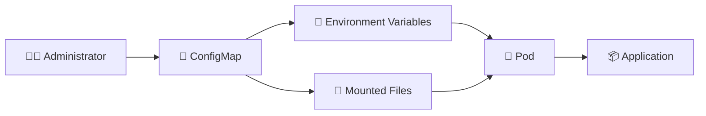

# ConfigMap 📘

## 1. Overview

A **ConfigMap** stores non-sensitive application configuration separately from container images.

It is commonly used for:

* Application modes
* URLs and hostnames
* Feature flags
* Port numbers
* Configuration files
* Command-line settings

ConfigMaps help keep container images reusable across different environments.

---

## 2. Configuration Flow



A Pod can consume a ConfigMap either as environment variables or as files.

---

## 3. Key Concepts

| Concept           | Purpose                                        |
| ----------------- | ---------------------------------------------- |
| `data`            | Stores string key-value pairs                  |
| `binaryData`      | Stores binary values                           |
| `configMapKeyRef` | Reads one key into an environment variable     |
| `envFrom`         | Imports multiple keys as environment variables |
| Volume mount      | Exposes ConfigMap keys as files                |

ConfigMaps should **not** be used for passwords, tokens, or other sensitive values.

---

## 4. Cheat Sheet

Create from literals:

```bash
kubectl create configmap app-config \
  --from-literal=APP_MODE=production \
  --from-literal=LOG_LEVEL=info
```

Create from a file:

```bash
kubectl create configmap nginx-config \
  --from-file=nginx.conf
```

List ConfigMaps:

```bash
kubectl get configmaps
kubectl get cm
```

Inspect:

```bash
kubectl describe configmap app-config
```

View YAML:

```bash
kubectl get configmap app-config -o yaml
```

Delete:

```bash
kubectl delete configmap app-config
```

---

## 5. Practical Example

Suppose the same application image runs in development and production.

Development may use:

```text
APP_MODE=development
LOG_LEVEL=debug
```

while production uses:

```text
APP_MODE=production
LOG_LEVEL=info
```

Instead of creating two container images, each environment can use its own ConfigMap.

The application image remains unchanged.

---

## 6. YAML Example

```yaml
apiVersion: v1
kind: ConfigMap
metadata:
  name: app-config
data:
  APP_MODE: "production"
  LOG_LEVEL: "info"
  API_URL: "http://api-service:8080"
---
apiVersion: v1
kind: Pod
metadata:
  name: web-app
spec:
  containers:
    - name: web
      image: nginx:1.27

      env:
        - name: APP_MODE
          valueFrom:
            configMapKeyRef:
              name: app-config
              key: APP_MODE

        - name: API_URL
          valueFrom:
            configMapKeyRef:
              name: app-config
              key: API_URL
```

The Pod reads selected values directly from `app-config`.

---

## 7. Common Problems 🚨

* ConfigMap does not exist
* Referenced key is missing
* ConfigMap is created in the wrong namespace
* Application expects a different value format
* Sensitive values are stored in the ConfigMap
* Environment-variable changes are not reflected in already running containers

---

## 8. Interview Questions 🎯

1. What is a ConfigMap?
2. Why should configuration be separated from container images?
3. How can a Pod consume ConfigMap data?
4. What is `configMapKeyRef`?
5. What is the difference between `env` and `envFrom`?
6. Should passwords be stored in ConfigMaps?
7. Are ConfigMaps namespaced?

---

## 9. Related Topics 🔗

* Environment Variables
* Secrets
* ConfigMaps as Volumes
* Pods
* Deployments
* Downward API
