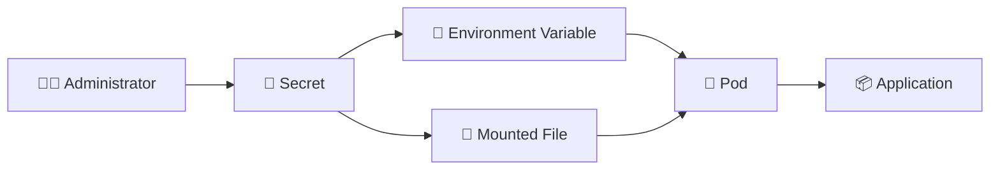

# Secret 🔐

## 1. Overview

A **Secret** stores sensitive configuration such as:

* Passwords
* API tokens
* TLS certificates
* SSH keys
* Registry credentials
* Database credentials

Secrets can be consumed by Pods as environment variables or mounted as files.

Kubernetes Secrets are **base64-encoded by default, not encrypted by default**, unless encryption at rest is configured for the cluster.

---

## 2. Secret Flow



---

## 3. Key Concepts

| Concept        | Purpose                                        |
| -------------- | ---------------------------------------------- |
| `data`         | Stores base64-encoded values                   |
| `stringData`   | Accepts plain strings when creating the Secret |
| `secretKeyRef` | Loads one key into an environment variable     |
| `envFrom`      | Imports multiple Secret keys                   |
| Volume mount   | Exposes Secret values as files                 |
| Secret type    | Describes the intended use                     |

Common types include:

* `Opaque`
* `kubernetes.io/tls`
* `kubernetes.io/dockerconfigjson`

---

## 4. Cheat Sheet

Create a Secret:

```bash id="3w7q9u"
kubectl create secret generic db-secret \
  --from-literal=username=admin \
  --from-literal=password='change-me'
```

List Secrets:

```bash id="5p6h2x"
kubectl get secrets
```

Inspect metadata:

```bash id="a6w9q3"
kubectl describe secret db-secret
```

View YAML:

```bash id="m4j2fz"
kubectl get secret db-secret -o yaml
```

Decode a value:

```bash id="0yq8ke"
kubectl get secret db-secret \
  -o jsonpath='{.data.username}' | base64 -d
```

Delete:

```bash id="rv4da8"
kubectl delete secret db-secret
```

---

## 5. Practical Example

Suppose a web application needs PostgreSQL credentials.

Instead of embedding them in the container image or Deployment YAML, an administrator stores them in:

```text id="2z9g8s"
db-secret
```

The Pod then references the Secret at runtime.

This separates application configuration from credentials and makes rotation easier.

---

## 6. YAML Example

```yaml id="q7v5da"
apiVersion: v1
kind: Secret
metadata:
  name: db-secret
type: Opaque

stringData:
  DB_USER: admin
  DB_PASSWORD: change-me

---
apiVersion: v1
kind: Pod
metadata:
  name: web-app
spec:
  containers:
    - name: web
      image: nginx:1.27

      env:
        - name: DB_USER
          valueFrom:
            secretKeyRef:
              name: db-secret
              key: DB_USER

        - name: DB_PASSWORD
          valueFrom:
            secretKeyRef:
              name: db-secret
              key: DB_PASSWORD
```

---

## 7. Common Problems 🚨

* Secret exists in the wrong namespace
* Referenced key is missing
* Base64 value is malformed
* Secret is exposed in logs or manifests
* RBAC allows excessive Secret access
* Credential rotation does not restart applications
* Secrets are mistaken for encrypted storage

---

## 8. Interview Questions 🎯

1. What is a Kubernetes Secret?
2. Are Secrets encrypted by default?
3. What is the difference between `data` and `stringData`?
4. How can a Pod consume a Secret?
5. Are Secrets namespaced?
6. What is `secretKeyRef`?
7. Why should Secret access be restricted with RBAC?

---

## 9. Related Topics 🔗

* ConfigMap
* Environment Variables
* Secrets as Volumes
* RBAC
* TLS
* ServiceAccounts
* External Secret Managers
