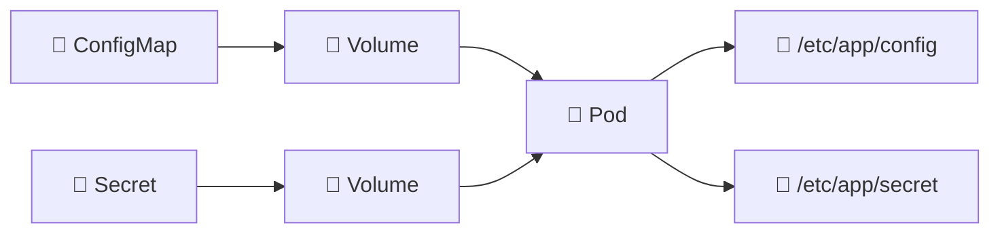

# ConfigMaps and Secrets as Volumes 💾

## 1. Overview

ConfigMaps and Secrets can be mounted into Pods as **files** instead of being exposed only as environment variables.

This is useful when applications expect configuration files, certificates, keys, or credentials at specific filesystem paths.

Typical examples include:

* `nginx.conf`
* TLS certificates
* SSH keys
* Application configuration files
* Database credential files

Mounted configuration is often cleaner than creating many individual environment variables.

---

## 2. Mounting Flow



Each ConfigMap or Secret key can appear as a file inside the container.

---

## 3. Key Concepts

| Concept        | Purpose                                |
| -------------- | -------------------------------------- |
| `volumes`      | Defines the ConfigMap or Secret volume |
| `volumeMounts` | Mounts it into the container           |
| `mountPath`    | Filesystem destination                 |
| `items`        | Selects or renames specific keys       |
| `readOnly`     | Prevents writes from the container     |

ConfigMaps and Secrets must normally exist in the same namespace as the Pod.

---

## 4. Cheat Sheet

Create a ConfigMap from a file:

```bash
kubectl create configmap nginx-config \
  --from-file=nginx.conf
```

Create a Secret from files:

```bash
kubectl create secret generic tls-files \
  --from-file=tls.crt \
  --from-file=tls.key
```

Inspect mounted files:

```bash
kubectl exec -it <pod-name> -- ls /etc/app
```

Read a ConfigMap-mounted file:

```bash
kubectl exec <pod-name> -- cat /etc/app/config/app.conf
```

Check Pod mounts:

```bash
kubectl describe pod <pod-name>
```

---

## 5. Practical Example

Suppose an application expects:

```text
/etc/app/config/app.conf
/etc/app/secrets/password
```

The configuration can be stored in a ConfigMap while the password is stored separately in a Secret.

The Pod mounts both resources into different directories.

This keeps configuration and sensitive information outside the container image.

---

## 6. YAML Example

```yaml
apiVersion: v1
kind: ConfigMap
metadata:
  name: app-config
data:
  app.conf: |
    mode=production
    log_level=info

---
apiVersion: v1
kind: Secret
metadata:
  name: app-secret
type: Opaque
stringData:
  password: super-secret

---
apiVersion: v1
kind: Pod
metadata:
  name: app
spec:
  containers:
    - name: app
      image: nginx:1.27

      volumeMounts:
        - name: config
          mountPath: /etc/app/config
          readOnly: true

        - name: secrets
          mountPath: /etc/app/secrets
          readOnly: true

  volumes:
    - name: config
      configMap:
        name: app-config

    - name: secrets
      secret:
        secretName: app-secret
```

Inside the Pod:

```text
/etc/app/config/app.conf
/etc/app/secrets/password
```

---

## 7. Common Problems 🚨

* ConfigMap or Secret does not exist
* Wrong `mountPath`
* Volume name does not match `volumeMounts`
* Application expects a different filename
* Secret permissions are too permissive
* Mounted volume hides existing files at the same path
* Configuration update is not detected by the application

---

## 8. Interview Questions 🎯

1. How can a ConfigMap be mounted as a volume?
2. How can a Secret be mounted as files?
3. What does `mountPath` define?
4. Why use mounted files instead of environment variables?
5. Can ConfigMaps and Secrets be mounted read-only?
6. What happens if a volume is mounted over an existing directory?
7. Are ConfigMap and Secret volumes persistent storage?

---

## 9. Related Topics 🔗

* ConfigMap
* Secret
* Volumes
* Environment Variables
* TLS Certificates
* Pods
