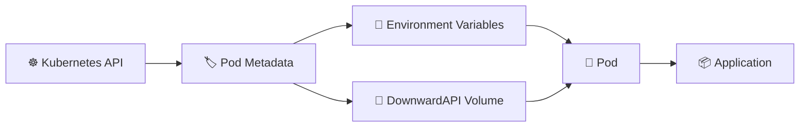

# Downward API ⬇️

## 1. Overview

The **Downward API** allows a container to access information about the Pod in which it is running.

Instead of hard-coding metadata, Kubernetes can expose values such as:

* Pod name
* Namespace
* Pod IP
* Node name
* Labels
* Annotations
* Resource requests and limits

These values can be injected as **environment variables** or exposed as **files**.

---

## 2. Information Flow



The container receives information about itself from Kubernetes.

---

## 3. Key Concepts

| Concept              | Purpose                         |
| -------------------- | ------------------------------- |
| `fieldRef`           | Reads Pod metadata fields       |
| `resourceFieldRef`   | Reads container resource values |
| `metadata.name`      | Pod name                        |
| `metadata.namespace` | Pod namespace                   |
| `status.podIP`       | Pod IP address                  |
| `spec.nodeName`      | Node hosting the Pod            |
| DownwardAPI volume   | Exposes metadata as files       |

---

## 4. Cheat Sheet

View Pod metadata:

```bash id="m7flwx"
kubectl get pod <pod-name> -o yaml
```

Check injected variables:

```bash id="g6j83b"
kubectl exec <pod-name> -- env
```

Print a specific variable:

```bash id="jv2f5p"
kubectl exec <pod-name> -- printenv POD_NAME
```

View labels:

```bash id="8o2sz3"
kubectl get pod <pod-name> --show-labels
```

Inspect Pod details:

```bash id="9wp4cb"
kubectl describe pod <pod-name>
```

---

## 5. Practical Example

Suppose an application writes logs containing the identity of the Pod producing them.

Instead of configuring a different value for every replica, Kubernetes can automatically inject:

```text id="zu8fun"
POD_NAME
POD_NAMESPACE
POD_IP
NODE_NAME
```

Each replica therefore knows its own runtime identity.

This is especially useful for logging, monitoring, debugging, and distributed applications.

---

## 6. YAML Example

```yaml id="j3y8sm"
apiVersion: v1
kind: Pod
metadata:
  name: web-app
  labels:
    app: web
spec:
  containers:
    - name: web
      image: nginx:1.27

      env:
        - name: POD_NAME
          valueFrom:
            fieldRef:
              fieldPath: metadata.name

        - name: POD_NAMESPACE
          valueFrom:
            fieldRef:
              fieldPath: metadata.namespace

        - name: POD_IP
          valueFrom:
            fieldRef:
              fieldPath: status.podIP

        - name: NODE_NAME
          valueFrom:
            fieldRef:
              fieldPath: spec.nodeName
```

Inside the container:

```bash id="i3sjwq"
echo $POD_NAME
echo $POD_NAMESPACE
echo $POD_IP
echo $NODE_NAME
```

---

## 7. Common Problems 🚨

* Incorrect `fieldPath`
* Expected field is not available
* Confusing `fieldRef` with `resourceFieldRef`
* Application expects metadata in a different format
* Trying to access arbitrary Kubernetes API fields

The Downward API exposes a defined subset of Pod and container information.

---

## 8. Interview Questions 🎯

1. What is the Kubernetes Downward API?
2. Why is it called the Downward API?
3. What is `fieldRef`?
4. What is `resourceFieldRef`?
5. How can a Pod discover its own name or namespace?
6. Can Downward API data be mounted as files?
7. How is the Downward API useful for monitoring and logging?

---

## 9. Related Topics 🔗

* Environment Variables
* ConfigMap
* Secret
* Labels and Annotations
* Resource Requests and Limits
* Pods
