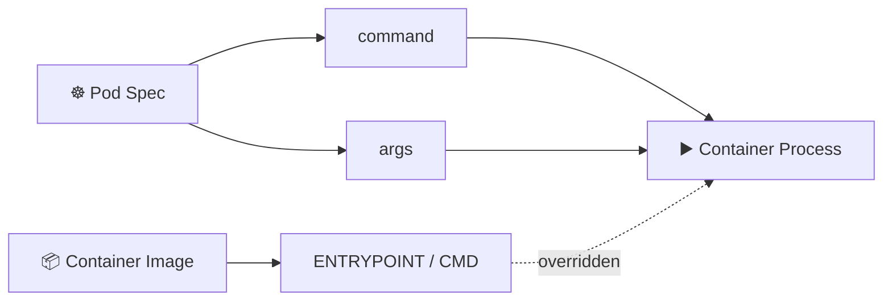

# Commands and Arguments ▶️

## 1. Overview

Kubernetes allows you to override the default command and arguments defined inside a container image.

This is useful when the same image needs to run in different ways without rebuilding it.

In Kubernetes:

| Kubernetes | Container Image |
| ---------- | --------------- |
| `command`  | `ENTRYPOINT`    |
| `args`     | `CMD`           |

Typical uses include:

* Running a different startup process
* Passing application parameters
* Changing runtime behavior
* Running debugging commands
* Reusing one image for multiple workloads

---

## 2. Execution Flow



Kubernetes values can replace the defaults defined inside the image.

---

## 3. Key Concepts

| Field            | Purpose                        |
| ---------------- | ------------------------------ |
| `command`        | Overrides the image entrypoint |
| `args`           | Overrides the image arguments  |
| `command + args` | Replaces both                  |
| `sh -c`          | Allows shell expressions       |

Values are normally written as YAML lists.

---

## 4. Cheat Sheet

Run a temporary Pod with a command:

```bash
kubectl run test \
  --image=busybox \
  --command -- sleep 3600
```

Pass arguments:

```bash
kubectl run nginx \
  --image=nginx \
  -- nginx -g "daemon off;"
```

Inspect the configuration:

```bash
kubectl get pod <pod-name> -o yaml
```

Check the running process:

```bash
kubectl exec <pod-name> -- ps
```

---

## 5. Practical Example

Suppose a BusyBox image normally starts its default process, but you want the container to print the current date every 10 seconds.

Instead of building a new image, Kubernetes can override its startup command:

```text
/bin/sh -c
while true; do date; sleep 10; done
```

This makes container images more reusable.

---

## 6. YAML Example

```yaml
apiVersion: v1
kind: Pod
metadata:
  name: command-demo
spec:
  containers:
    - name: busybox
      image: busybox:1.36

      command:
        - /bin/sh
        - -c

      args:
        - |
          while true; do
            echo "Current time:"
            date
            sleep 10
          done
```

View the output:

```bash
kubectl logs command-demo
```

---

## 7. Common Problems 🚨

* Incorrect executable path
* Confusing `command` with `args`
* Shell syntax used without `sh -c`
* Container exits immediately
* Quoting issues in YAML
* Overriding an important image entrypoint

---

## 8. Interview Questions 🎯

1. What is the difference between `command` and `args`?
2. How do they relate to Docker `ENTRYPOINT` and `CMD`?
3. What happens if only `args` is specified?
4. Why might you use `sh -c`?
5. Can Kubernetes override a container image's startup command?
6. Why is command overriding useful for reusable images?

---

## 9. Related Topics 🔗

* Pods
* Container Images
* Environment Variables
* ConfigMaps
* Jobs
* CronJobs
