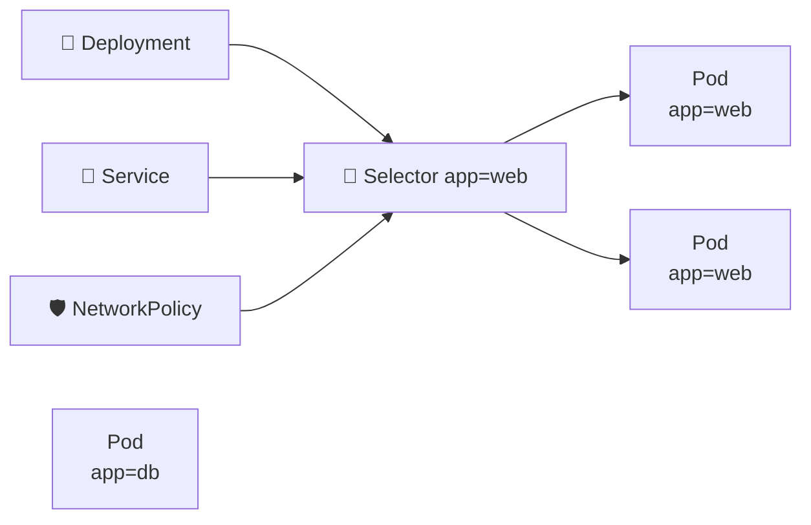

# Labels and Selectors 🏷️

## 1. Overview

**Labels** are key-value pairs attached to Kubernetes objects.

They are used to organize, identify, group, and select resources.

Common examples include:

* Application name
* Environment
* Version
* Tier
* Team

**Selectors** are expressions used by Kubernetes objects to find resources with matching labels.

---

## 2. Selection Flow



The selector determines which objects are targeted.

---

## 3. Key Concepts

| Concept            | Purpose                       |
| ------------------ | ----------------------------- |
| `labels`           | Adds identifying metadata     |
| `selector`         | Finds matching resources      |
| `matchLabels`      | Exact label matching          |
| `matchExpressions` | Advanced selector rules       |
| Equality selector  | `app=web`                     |
| Set selector       | `environment in (prod,stage)` |

Labels are intended for **identification and selection**.

For non-identifying metadata, use annotations instead.

---

## 4. Cheat Sheet

Show labels:

```bash id="pvz9pc"
kubectl get pods --show-labels
```

Add a label:

```bash id="h9656v"
kubectl label pod web app=frontend
```

Modify a label:

```bash id="v4zc28"
kubectl label pod web app=backend --overwrite
```

Remove a label:

```bash id="sd9o3l"
kubectl label pod web app-
```

Select Pods:

```bash id="jps1o9"
kubectl get pods -l app=web
```

Multiple conditions:

```bash id="b6n8pc"
kubectl get pods -l 'environment=prod,tier=frontend'
```

Set-based selector:

```bash id="znh6q3"
kubectl get pods -l 'environment in (prod,stage)'
```

---

## 5. Practical Example

Suppose three Pods exist:

```text id="tsdo1n"
web-1   app=web
web-2   app=web
db-1    app=database
```

A Service using:

```yaml id="gkh22r"
selector:
  app: web
```

will automatically send traffic only to `web-1` and `web-2`.

If another Pod with `app=web` is created, it can automatically become part of the Service backend.

---

## 6. YAML Example

```yaml id="6yf872"
apiVersion: apps/v1
kind: Deployment
metadata:
  name: web
  labels:
    app: web
spec:
  replicas: 3

  selector:
    matchLabels:
      app: web

  template:
    metadata:
      labels:
        app: web
        environment: production

    spec:
      containers:
        - name: nginx
          image: nginx:1.27
```

The Deployment selector must match the labels assigned to its Pod template.

---

## 7. Common Problems 🚨

* Selector does not match Pod labels
* Typo in label key or value
* Service has no matching Pods
* Deployment selector and Pod template labels conflict
* Labels are changed unexpectedly
* Using annotations where selectors are required

---

## 8. Interview Questions 🎯

1. What are Kubernetes labels?
2. What are selectors used for?
3. What is `matchLabels`?
4. What is `matchExpressions`?
5. How does a Service use labels?
6. How does a Deployment use selectors?
7. What is the difference between labels and annotations?

---

## 9. Related Topics 🔗

* Annotations
* Deployments
* Services
* NetworkPolicy
* ReplicaSet
* Pods
