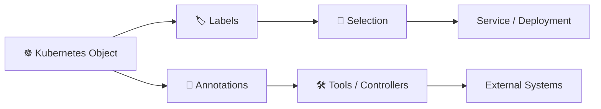

# Annotations 📝

## 1. Overview

**Annotations** attach non-identifying metadata to Kubernetes objects.

Unlike labels, annotations are **not used to select resources**.

They are commonly used for:

* Tooling metadata
* Build information
* Git commit references
* External IDs
* Contact information
* Ingress/controller configuration
* Operational notes

Annotations can store larger and more descriptive values than labels.

---

## 2. Metadata Flow



Labels identify objects.
Annotations describe them.

---

## 3. Key Concepts

| Concept                | Purpose                               |
| ---------------------- | ------------------------------------- |
| `metadata.annotations` | Stores annotation values              |
| Labels                 | Used for identification and selection |
| Annotations            | Used for descriptive metadata         |
| Key/value format       | Both use metadata key-value pairs     |

Annotation values are strings and can contain structured information such as JSON.

Example:

```yaml
annotations:
  git-commit: "a81f32c"
  owner: "platform-team"
```

---

## 4. Cheat Sheet

Show annotations:

```bash
kubectl describe pod <pod-name>
```

Add an annotation:

```bash
kubectl annotate pod web \
  owner=platform-team
```

Update an annotation:

```bash
kubectl annotate pod web \
  owner=devops-team --overwrite
```

Remove an annotation:

```bash
kubectl annotate pod web owner-
```

View annotations directly:

```bash
kubectl get pod web \
  -o jsonpath='{.metadata.annotations}'
```

---

## 5. Practical Example

Suppose a Deployment is created automatically by a CI/CD pipeline.

Useful metadata might include:

```text
git-commit=a81f32c
build-number=284
repository=name-db
```

These values help operators identify exactly which build produced the running workload.

They do not determine which Pods belong to a Service or Deployment.

That job belongs to **labels and selectors**.

---

## 6. YAML Example

```yaml
apiVersion: apps/v1
kind: Deployment
metadata:
  name: web
  annotations:
    owner: "platform-team"
    git-commit: "a81f32c"
    documentation: "internal-web-service"
spec:
  replicas: 2

  selector:
    matchLabels:
      app: web

  template:
    metadata:
      labels:
        app: web

      annotations:
        build-number: "284"

    spec:
      containers:
        - name: nginx
          image: nginx:1.27
```

Notice that the Deployment itself and its Pods can have different annotations.

---

## 7. Common Problems 🚨

* Using annotations when a selector is required
* Confusing Pod annotations with Deployment annotations
* Expecting annotations to affect scheduling
* Overusing annotations for large application data
* Controller-specific annotation is misspelled

---

## 8. Interview Questions 🎯

1. What are Kubernetes annotations?
2. What is the difference between labels and annotations?
3. Can selectors use annotations?
4. What kind of information should annotations contain?
5. Can Pods and Deployments have different annotations?
6. How can external tools use annotations?

---

## 9. Related Topics 🔗

* Labels and Selectors
* Pods
* Deployments
* Ingress
* CI/CD
* Kubernetes Metadata
