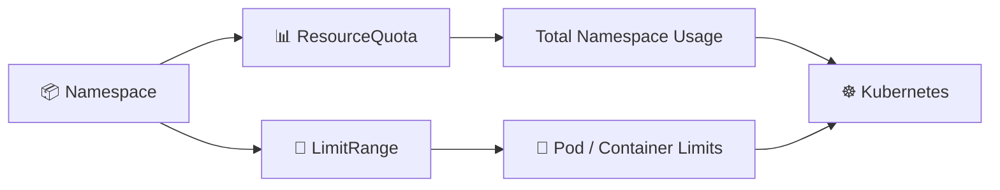

# ResourceQuota and LimitRange 📊

## 1. Overview

`ResourceQuota` and `LimitRange` control how resources are consumed inside a Kubernetes namespace.

They solve different problems:

* **ResourceQuota** limits the total resources the namespace may consume.
* **LimitRange** defines default, minimum, or maximum resource values for individual Pods or containers.

Together, they help prevent uncontrolled resource usage.

---

## 2. Resource Control Flow



---

## 3. Key Concepts

| Object          | Scope                 | Purpose                                  |
| --------------- | --------------------- | ---------------------------------------- |
| `ResourceQuota` | Namespace             | Limits total resource consumption        |
| `LimitRange`    | Namespace             | Controls individual Pod/container values |
| `requests`      | Scheduler reservation | Guaranteed requested resources           |
| `limits`        | Runtime ceiling       | Maximum allowed consumption              |

A namespace can have both objects at the same time.

---

## 4. Cheat Sheet

List quotas:

```bash id="jcxx31"
kubectl get resourcequota
kubectl get quota
```

Inspect quota usage:

```bash id="t8jdq2"
kubectl describe resourcequota
```

List LimitRanges:

```bash id="dr12km"
kubectl get limitrange
kubectl get limits
```

Inspect:

```bash id="w5kaoz"
kubectl describe limitrange <name>
```

View namespace resources:

```bash id="z9mwws"
kubectl get resourcequota,limitrange
```

---

## 5. Practical Example

Suppose a development namespace should never consume more than:

```text id="njri0e"
CPU:     8 cores
Memory:  16 GiB
Pods:    20
```

A `ResourceQuota` can enforce these totals.

At the same time, a `LimitRange` can automatically give containers default values such as:

```text id="5wm79i"
Request: 100m CPU / 128Mi memory
Limit:   500m CPU / 512Mi memory
```

This prevents developers from accidentally creating containers without resource constraints.

---

## 6. YAML Example

```yaml id="ptix9k"
apiVersion: v1
kind: ResourceQuota
metadata:
  name: dev-quota
  namespace: development
spec:
  hard:
    requests.cpu: "4"
    requests.memory: 8Gi
    limits.cpu: "8"
    limits.memory: 16Gi
    pods: "20"

---
apiVersion: v1
kind: LimitRange
metadata:
  name: container-limits
  namespace: development
spec:
  limits:
    - type: Container

      defaultRequest:
        cpu: 100m
        memory: 128Mi

      default:
        cpu: 500m
        memory: 512Mi

      min:
        cpu: 50m
        memory: 64Mi

      max:
        cpu: "2"
        memory: 2Gi
```

`ResourceQuota` controls the namespace total, while `LimitRange` controls individual containers.

---

## 7. Common Problems 🚨

* Pod exceeds the namespace quota
* Container exceeds the LimitRange maximum
* Required requests or limits are missing
* Namespace quota is already exhausted
* CPU units such as `m` are misunderstood
* Memory units such as `Mi` and `Gi` are confused

A rejected workload usually produces an admission error explaining which policy was violated.

---

## 8. Interview Questions 🎯

1. What is a ResourceQuota?
2. What is a LimitRange?
3. What is the difference between them?
4. At what scope do they operate?
5. Can LimitRange provide default requests and limits?
6. What happens when a namespace exceeds its quota?
7. Can ResourceQuota limit the number of Pods?

---

## 9. Related Topics 🔗

* Resource Requests and Limits
* Namespaces
* Scheduling
* Pods
* QoS Classes
* Admission Control
